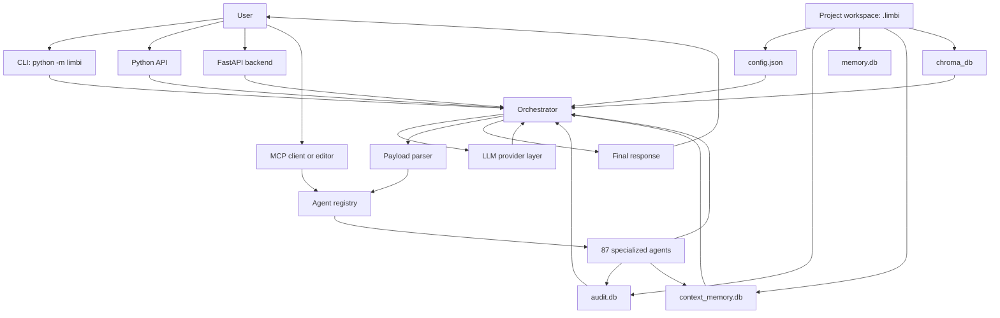
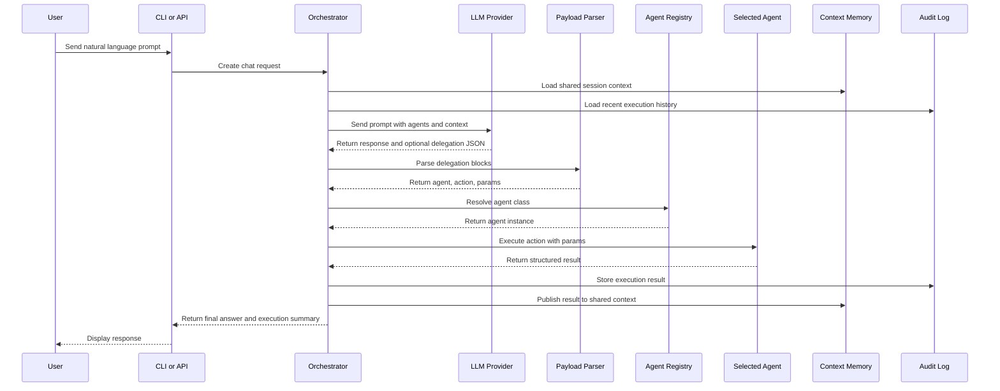
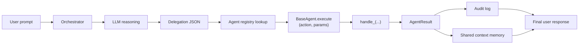

<div align="center">
  <picture>
    <source media="(prefers-color-scheme: dark)" srcset="assets/limbi-animated.svg">
    <source media="(prefers-color-scheme: light)" srcset="assets/limbi-animated.svg">
    
  </picture>

  <br/><br/>

  [](https://www.python.org/)
  [](#agent-catalog)
  [](#agent-catalog)
  [](LICENSE)
</div>

Limbi is an omni-agent orchestration platform for running many specialized AI agents from one command, one Python API, or one MCP-compatible editor workflow.

Current package version: `1.1.0`

Current system size:

- 87 registered agents
- 410 available agent actions
- 15 supported LLM provider modes
- CLI, Python API, FastAPI backend, MCP server, and VS Code extension support

Limbi is built for developers, operators, founders, researchers, and teams who want an AI assistant that can coordinate work across engineering, infrastructure, cloud, security, data, documentation, business operations, and industry-specific tasks.

## Why Limbi Exists

Most AI tools are good at answering questions, but real work usually needs more than an answer.

A realistic task can involve many separate roles:

- A planner to break the goal into steps.
- A code agent to inspect or generate code.
- A security agent to check risks.
- A testing agent to prepare validation.
- A DevOps or cloud agent to prepare deployment.
- A documentation agent to write the final explanation.
- A memory layer to carry findings from one step into the next.

Without orchestration, the user has to copy information between prompts, tools, dashboards, terminals, cloud consoles, tickets, and documents. That creates context switching, repeated work, and mistakes.

Limbi was built to solve that coordination problem.

Instead of asking one general model to do every job alone, Limbi lets the model act as an orchestrator. It can talk normally, choose the right agent, run agent actions, collect the result, store the result in shared context memory, and continue the workflow with better context.

Limbi also understands more than one local model style. If you run Ollama, LM Studio, vLLM, LocalAI, KoboldCpp, llama.cpp, or any other local OpenAI-compatible server, Limbi can treat it as a local provider and skip API-key prompts when the endpoint is clearly local.

## What Problem Limbi Solves

Limbi solves four core problems.

| Problem | What usually happens | What Limbi provides |
| --- | --- | --- |
| Tool fragmentation | Users switch between many tools and manually copy context. | One orchestration layer for many domains. |
| Generic AI responses | A single model tries to reason about every domain at once. | Specialized agents with focused responsibilities. |
| Lost context | Findings from one step are forgotten in the next step. | Shared context memory between agents. |
| Weak execution trail | Users cannot easily see what was executed or why. | Audit logging, structured results, and workspace state. |

## Is Limbi Necessary

Limbi is useful when your task needs coordination across multiple areas.

Use Limbi when:

- You want one prompt to involve planning, code, testing, security, cloud, documentation, or operations.
- You want to switch LLM providers without changing your application code.
- You want project-local memory and audit logs.
- You want an MCP server that exposes agent tools to compatible editors or AI clients.
- You want to build on a reusable multi-agent framework instead of writing glue code from scratch.

Limbi may not be necessary when:

- You only need a simple one-off chat response.
- You do not need agents, memory, tools, or orchestration.
- You do not want local workspace files such as `.limbi/config.json`.
- Your use case is better served by a single direct API call to one LLM provider.

## How Limbi Works

Every Limbi request follows the same high-level lifecycle.

1. The user sends a prompt through the CLI, Python API, FastAPI server, or MCP client.
2. Limbi initializes or loads the local `.limbi/` workspace.
3. The orchestrator loads provider settings, agent registry data, recent executions, shared context, and optional RAG context.
4. The selected LLM receives the prompt and decides whether to answer directly or delegate work.
5. If delegation is needed, Limbi parses structured JSON delegation blocks from the LLM response.
6. The orchestrator resolves the target agent and action from the registry.
7. Agent actions execute and return structured results.
8. Results are logged to the audit database.
9. Results are published to shared context memory.
10. Limbi returns a final response that includes the answer and execution summary.

## Architecture



### Architecture Explanation

The CLI, Python API, FastAPI server, and MCP server are entry points. They all route work into the Limbi system.

The `.limbi/` workspace stores local project state. It contains configuration, audit logs, memory databases, session data, logs, and optional vector search data.

The orchestrator is the core controller. It prepares the LLM prompt, injects agent registry data, reads memory, retrieves optional RAG context, executes delegations, retries failures, and returns the final response.

The provider layer hides differences between LLM vendors. Users can move between local Ollama models, local OpenAI-compatible servers such as LM Studio, vLLM, LocalAI, or KoboldCpp, and hosted providers such as OpenAI, Anthropic, Google, Groq, Mistral, Azure OpenAI, Cohere, Together AI, and OpenAI-compatible endpoints.

The payload parser extracts structured agent delegation blocks from the LLM output.

The agent registry maps names such as `security_agent` or `testing_agent` to Python agent classes and their available actions.

The shared context memory system lets one agent's result influence later work. For example, if the security agent finds a critical issue, the DevOps agent can see that context before preparing a deployment plan.

## Runtime Feedback

Limbi shows live runtime feedback while a prompt is running.

While it works, the terminal updates an elapsed-time indicator so you know the request is still moving.

When the run finishes, Limbi prints a compact summary with:

- latency
- prompt token usage
- completion token usage
- total token usage
- an estimated hallucination risk percentage

That hallucination value is a heuristic, not a scientific measurement. It is there to help you spot when a prompt may need more structure or when the model seems to be stretching.

## Execution Pipeline



## Agent Working Model

All agents follow the same contract.



Each agent is a Python class that inherits from `BaseAgent`. An agent exposes actions by defining methods named `handle_<action_name>`. For example, an agent with `handle_review` exposes an action named `review`.

When the orchestrator executes an action, the agent returns an `AgentResult` with:

- `success`
- `agent`
- `action`
- `data`
- `error`

That structure makes results predictable and easy to log, summarize, and reuse.

## Agent Categories

Limbi currently registers 87 agents. The exact list can be checked at any time:

```bash
python -m limbi --list-agents
```

### Cognitive and Reasoning Agents

These agents help the system plan, route, critique, reason, coordinate, learn, evaluate, and remember.

| Agent | Main responsibility |
| --- | --- |
| `planner_agent` | Breaks large goals into smaller execution steps. |
| `critic_agent` | Reviews plans and outputs for quality, gaps, and risk. |
| `router_agent` | Classifies prompts and chooses suitable agents. |
| `react_agent` | Supports reason-and-act style workflows. |
| `reflex_agent` | Provides reflexive evaluation and adaptation behavior. |
| `model_reflex_agent` | Handles model-oriented reflex workflows. |
| `taskloop_agent` | Supports repeated task loops and iterative execution. |
| `memory_agent` | Stores and recalls conversation memory. |
| `context_memory_agent` | Shares results between agents in a session. |
| `swarm_agent` | Coordinates multi-agent workflows. |
| `evaluation_agent` | Benchmarks and evaluates outputs. |
| `learning_agent` | Captures learning and feedback over time. |
| `knowledge_agent` | Stores and retrieves reusable knowledge. |
| `research_agent` | Helps gather and structure research findings. |

### Engineering Agents

These agents work on software engineering tasks such as code, files, tests, databases, migrations, Git, and documentation.

| Agent | Main responsibility |
| --- | --- |
| `code_agent` | Generates, explains, reviews, and debugs code. |
| `file_agent` | Reads, writes, searches, and organizes files. |
| `git_agent` | Handles Git-oriented operations and explanations. |
| `database_agent` | Works with schemas, queries, migrations, and database planning. |
| `testing_agent` | Creates test plans, test cases, and quality checks. |
| `qa_agent` | Supports quality assurance strategy and regression thinking. |
| `migration_agent` | Plans and describes migrations between systems or schemas. |
| `docs_agent` | Produces and updates documentation. |
| `documentation_agent` | Generates README files, API docs, ADRs, runbooks, and glossaries. |
| `data_agent` | Supports data processing and analysis workflows. |
| `nlp_agent` | Supports text classification, summarization, entities, translation, and intent work. |
| `analytics_agent` | Handles analytics reports and insight generation. |
| `reporting_agent` | Builds structured reports and summaries. |
| `performance_agent` | Reviews performance, latency, capacity, and optimization. |

### DevOps, Cloud, and Platform Agents

These agents support infrastructure, deployment, observability, cloud, Kubernetes, CI/CD, and platform operations.

| Agent | Main responsibility |
| --- | --- |
| `devops_agent` | Coordinates deployment and operations workflows. |
| `cicd_agent` | Works with CI/CD pipelines, releases, and rollback planning. |
| `sre_agent` | Supports reliability, incidents, SLOs, and operational health. |
| `incident_agent` | Helps triage and summarize incidents. |
| `observability_agent` | Works with logs, metrics, alerts, and monitoring plans. |
| `aws_agent` | Supports AWS-oriented workflows. |
| `gcp_agent` | Supports Google Cloud workflows. |
| `azure_agent` | Supports Azure workflows. |
| `kubernetes_agent` | Supports Kubernetes manifests, scaling, pods, and clusters. |
| `api_gateway_agent` | Supports API gateway routes, rate limits, CORS, auth, and health. |
| `workflow_agent` | Creates, validates, and visualizes workflows. |
| `integration_agent` | Plans and describes service integrations. |
| `auth_agent` | Supports authentication, tokens, and authorization workflows. |
| `feature_flag_agent` | Creates, toggles, lists, and evaluates feature flags. |
| `notification_agent` | Supports notification and message delivery workflows. |
| `scheduler_agent` | Supports scheduling and calendar-style coordination. |
| `os_agent` | Supports operating-system-oriented tasks. |
| `browser_agent` | Supports browser-oriented tasks and web interaction workflows. |
| `tool_builder_agent` | Generates tool specifications and helper tooling. |

### Security, Governance, and Compliance Agents

These agents help identify risk, prepare policy decisions, and support governance.

| Agent | Main responsibility |
| --- | --- |
| `security_agent` | Supports security reviews, dependency scans, secrets checks, and risk summaries. |
| `compliance_agent` | Supports audits, compliance reports, and gap analysis. |
| `policy_agent` | Supports policy interpretation and policy drafting. |
| `approval_agent` | Supports approval workflows and human-in-the-loop gates. |
| `legal_agent` | Supports legal summaries, contract review, and compliance-oriented reasoning. |
| `government_agent` | Supports government service, grant, and policy workflows. |

### Business and Operations Agents

These agents help with sales, finance, support, marketing, people operations, and business process work.

| Agent | Main responsibility |
| --- | --- |
| `finance_agent` | Supports financial summaries, forecasts, and budget reasoning. |
| `sales_agent` | Supports sales planning, lead qualification, and proposal outlines. |
| `payments_agent` | Supports payment, invoice, refund, subscription, and analytics flows. |
| `cost_agent` | Supports cost reports, forecasts, and optimization. |
| `procurement_agent` | Supports purchasing, vendor, and procurement workflows. |
| `customer_support_agent` | Supports support response and ticket workflows. |
| `customer_success_agent` | Supports success plans, risk summaries, and customer health. |
| `marketing_agent` | Supports campaign, messaging, and marketing planning. |
| `social_media_agent` | Supports content calendars, drafts, sentiment, and moderation. |
| `hr_agent` | Supports HR plans, policy summaries, and people operations. |
| `recruiting_agent` | Supports candidate and recruiting workflows. |
| `onboarding_agent` | Supports onboarding plans and checklists. |
| `project_management_agent` | Supports projects, sprints, risks, and delivery planning. |
| `jira_agent` | Supports Jira issue and project-tracking workflows. |
| `comms_agent` | Supports communication drafts and internal updates. |
| `feedback_agent` | Supports feedback collection and improvement loops. |

### Industry and Domain Agents

These agents provide domain-specific support for common verticals.

| Agent | Main responsibility |
| --- | --- |
| `healthcare_agent` | Supports healthcare summaries and operational workflows. |
| `education_agent` | Supports lesson plans, quizzes, learning paths, and rubrics. |
| `real_estate_agent` | Supports listings, real estate summaries, and investment reasoning. |
| `ecommerce_agent` | Supports product listings, commerce operations, and pricing workflows. |
| `insurance_agent` | Supports policy summaries, claims, fraud signals, and underwriting checklists. |
| `logistics_agent` | Supports routing, shipments, warehouse summaries, and demand buffers. |
| `hospitality_agent` | Supports hospitality planning and service workflows. |
| `travel_agent` | Supports travel planning and related operations. |
| `manufacturing_agent` | Supports manufacturing plans and operational summaries. |
| `agriculture_agent` | Supports crop plans, harvest schedules, field risk, and input budgets. |
| `energy_agent` | Supports energy usage, planning, and sustainability workflows. |
| `sustainability_agent` | Supports ESG, supply chain, waste, water, and sustainability scoring. |
| `blockchain_agent` | Supports wallet risk, tokenomics, smart contract checklists, and transactions. |
| `iot_agent` | Supports IoT fleet, telemetry, and device operations. |
| `media_agent` | Supports media planning, production schedules, and distribution plans. |
| `design_agent` | Supports product and interface design planning. |
| `multimodal_agent` | Supports workflows involving multiple content types. |
| `simulation_agent` | Supports simulation planning and scenario analysis. |

## Installation Guide

### 1. Check Python First

Limbi requires Python 3.11 or newer.

```bash
python --version
```

If the version is lower than 3.11, install Python 3.11 or newer before continuing.

On macOS with Homebrew:

```bash
brew install python@3.11
```

Then create a virtual environment:

```bash
python3.11 -m venv .venv
source .venv/bin/activate
python --version
```

The final command should show Python 3.11 or newer.

### 2. Install Limbi

For normal use from PyPI:

```bash
python -m pip install --upgrade pip
python -m pip install limbi
```

For local development from this repository:

```bash
python -m pip install --upgrade pip
python -m pip install -e .
```

If you want every optional provider and server feature:

```bash
python -m pip install "limbi[all]"
```

### 3. Verify The Install

Because some paths with spaces can break console scripts, this README uses module execution as the safe command form.

```bash
python -m limbi --version
python -m limbi --list-providers
python -m limbi --list-agents
```

Expected checks:

- Version should print the installed Limbi version.
- Providers should list provider names such as `ollama`, `lmstudio`, `vllm`, `localai`, `koboldcpp`, `openai`, `anthropic`, `google`, and `groq`.
- Agents should list 87 agents.

### 4. Choose An LLM Provider

Limbi defaults to Ollama.

For local Ollama:

```bash
ollama serve
ollama pull llama3.2:3b
export LLM_PROVIDER=ollama
export LLM_MODEL=llama3.2:3b
```

For other local model servers, use the OpenAI-compatible provider. Limbi treats localhost endpoints as local, so it will not ask for an API key when the base URL is clearly local.

For LM Studio:

```bash
python -m pip install "limbi[openai]"
export LLM_PROVIDER=lmstudio
export LLM_BASE_URL="http://localhost:1234/v1"
export LLM_MODEL="local-model-name"
```

For vLLM:

```bash
python -m pip install "limbi[openai]"
export LLM_PROVIDER=vllm
export LLM_BASE_URL="http://localhost:8000/v1"
export LLM_MODEL="local-model-name"
```

For LocalAI:

```bash
python -m pip install "limbi[openai]"
export LLM_PROVIDER=localai
export LLM_BASE_URL="http://localhost:8080/v1"
export LLM_MODEL="local-model-name"
```

For KoboldCpp:

```bash
python -m pip install "limbi[openai]"
export LLM_PROVIDER=koboldcpp
export LLM_BASE_URL="http://localhost:5001/v1"
export LLM_MODEL="local-model-name"
```

For llama.cpp:

```bash
python -m pip install "limbi[openai]"
export LLM_PROVIDER=llamacpp
export LLM_BASE_URL="http://localhost:8081/v1"
export LLM_MODEL="local-model-name"
```

For OpenAI:

```bash
python -m pip install "limbi[openai]"
export LLM_PROVIDER=openai
export LLM_MODEL=gpt-4o
export LLM_API_KEY="your_api_key_here"
```

For Anthropic:

```bash
python -m pip install "limbi[anthropic]"
export LLM_PROVIDER=anthropic
export LLM_MODEL=claude-sonnet-4-20250514
export LLM_API_KEY="your_api_key_here"
```

For Groq:

```bash
python -m pip install "limbi[groq]"
export LLM_PROVIDER=groq
export LLM_MODEL=llama-3.1-70b-versatile
export LLM_API_KEY="your_api_key_here"
```

For an OpenAI-compatible local server:

```bash
python -m pip install "limbi[openai]"
export LLM_PROVIDER=openai_compatible
export LLM_BASE_URL="http://localhost:1234/v1"
export LLM_MODEL="local-model-name"
export LLM_API_KEY="not-needed"
```

### 5. Run A Prompt

Use one-shot mode:

```bash
python -m limbi "what agents do you have?"
```

Use interactive mode:

```bash
python -m limbi
```

Inside interactive mode:

```text
/model
/models
/agent
/agents
/providers
/trust
/clear
/help
/quit
```

### 6. Understand The Workspace

On first run, Limbi creates a hidden `.limbi/` folder in the current directory.

The first launch also asks whether you trust the current workspace. If you deny it, Limbi exits instead of working in that folder.

```text
.limbi/
|-- config.json
|-- audit.db
|-- memory.db
|-- context_memory.db
|-- chroma_db/
|-- sessions/
`-- logs/
```

Use this to see hidden folders:

```bash
ls -a
```

The CLI first-run message is plain text and does not use emoji icons.

### 7. Optional RAG Setup

RAG and codebase vector search require ChromaDB.

```bash
python -m pip install "limbi[rag]"
```

Then use the Python API:

```python
from limbi import Orchestrator

orch = Orchestrator()
print(orch.ingest_codebase("."))
print(orch.vector_store_stats())
```

If ChromaDB is not installed, normal chat can still work. Only codebase indexing and vector search need this extra.

### 8. Optional MCP Setup

Generate MCP configuration:

```bash
python -m limbi --generate-mcp-config
```

This writes:

```text
.vscode/mcp.json
```

The generated config uses:

```bash
python -m limbi.mcp_server
```

Do not expect `python -m limbi.mcp_server` to answer like a chat command. It is a stdio server and waits for an MCP client to send JSON-RPC input.

## CLI Commands

Use the safe module form:

```bash
python -m limbi "prompt"
python -m limbi
python -m limbi --list-agents
python -m limbi --list-providers
python -m limbi --generate-mcp-config
python -m limbi --version
python -m limbi --help
```

If your path does not contain spaces and the console script works, this shorter form is also available:

```bash
limbi "prompt"
limbi --list-agents
```

## Provider Configuration

| Variable | Default | Purpose |
| --- | --- | --- |
| `LLM_PROVIDER` | `ollama` | Provider to use. |
| `LLM_MODEL` | `llama3.2:3b` | Model name. |
| `LLM_API_KEY` | Empty | API key for hosted providers. |
| `LLM_BASE_URL` | `http://localhost:11434` | Provider base URL. |
| `LLM_TEMPERATURE` | `0.2` | Sampling temperature. |
| `LLM_MAX_TOKENS` | `2048` | Maximum output tokens. |
| `AZURE_DEPLOYMENT` | Empty | Azure OpenAI deployment name. |
| `AZURE_API_VERSION` | `2024-06-01` | Azure OpenAI API version. |
| `LIMBI_API_KEY` | Empty | Optional API key required by the HTTP backend. |
| `LIMBI_CORS_ORIGINS` | Localhost defaults | Comma-separated browser origins allowed to call the backend. |

If you enable `LIMBI_API_KEY`, set the same value in the VS Code setting `limbi.apiKey` so the extension can keep working.

## Manual Control Commands

Use `/models` when you want to choose the provider, model, and endpoint manually for the current session. Limbi will ask for an API key only when the selected provider actually needs one.

Use `/agent` when you want to manually choose one registered agent and run one of its actions directly.

These commands do not replace the normal orchestrator. They sit beside it, so you can keep the automatic workflow for normal prompts and switch to manual control only when you need it.

You can use the Up and Down arrow keys to move through the `/models` and `/agent` selection screens, then press Enter to confirm.

## Security Hardening

Limbi now includes a few protections that matter if you run the backend beyond a private local terminal:

- API access can be protected with `LIMBI_API_KEY`.
- Browser access is limited through `LIMBI_CORS_ORIGINS` instead of allowing every origin.
- Audit records are sanitized before they are stored and before they are returned from the API.
- Internal exception details are no longer echoed back to clients.
- MCP and the VS Code extension can send the same API key so authenticated setups still work smoothly.
- The CLI asks whether to trust a workspace before it starts work in that folder.
- The CLI only asks for an API key when the selected provider or local endpoint truly needs one.

Recommended setup for anything shared, exposed, or long-lived:

```bash
export LIMBI_API_KEY="choose-a-long-random-secret"
export LIMBI_CORS_ORIGINS="http://127.0.0.1:8000,http://localhost:8000"
```

If you are only using Limbi on your own machine, you can leave `LIMBI_API_KEY` empty and keep the default localhost origins.

## Python API

```python
import asyncio
from limbi import Orchestrator, list_agents, get_llm_provider

async def main():
    agents = list_agents()
    action_count = sum(len(actions) for actions in agents.values())
    print(f"{len(agents)} agents, {action_count} actions")

    provider = get_llm_provider()
    print(provider.info())

    orch = Orchestrator(session_id="demo")
    result = await orch.chat(
        "Plan a safe deployment and identify testing, security, and rollback tasks."
    )
    print(result["conversation_text"])

asyncio.run(main())
```

## FastAPI Backend

Install server dependencies:

```bash
python -m pip install "limbi[server]"
```

Run from the repository root:

```bash
uvicorn main:app --reload
```

Useful endpoints:

| Endpoint | Purpose |
| --- | --- |
| `GET /health` | Backend health. |
| `POST /api/chat` | Send a chat message. |
| `POST /api/chat/clear` | Clear chat history. |
| `GET /api/agents` | List agents. |
| `POST /api/agents/{agent_name}/{action}` | Run a specific agent action. |
| `GET /api/audit/executions` | View recent executions. |
| `GET /api/audit/stats` | View execution statistics. |
| `POST /api/rag/ingest` | Index a directory for RAG. |
| `GET /api/rag/stats` | View vector store statistics. |

Example:

```bash
curl -X POST http://127.0.0.1:8000/api/chat \
  -H "Content-Type: application/json" \
  -d '{"message":"prepare a deployment checklist","stream":false}'
```

If you enabled `LIMBI_API_KEY`, include it in the request:

```bash
curl -X POST http://127.0.0.1:8000/api/chat \
  -H "Content-Type: application/json" \
  -H "Authorization: Bearer $LIMBI_API_KEY" \
  -d '{"message":"prepare a deployment checklist","stream":false}'
```

## Common Errors And Fixes

### `bad interpreter`

This can happen when the virtual environment path contains spaces.

Use:

```bash
python -m limbi "prompt"
```

Instead of:

```bash
limbi "prompt"
```

### `Provider requires an API key`

If you select a hosted provider, Limbi will ask for the key in the terminal and use it for that session.

If you are using a local model service and Limbi still asks for a key, check that:

- `LLM_PROVIDER` is set to a local provider such as `ollama`, `lmstudio`, `vllm`, `localai`, `koboldcpp`, or `llamacpp`
- `LLM_BASE_URL` points to a local address such as `localhost` or `127.0.0.1`

### `No such option: --generate-mcp-config`

You are using an older installed package.

For local development:

```bash
python -m pip install -e .
python -m limbi --generate-mcp-config
```

For PyPI users:

```bash
python -m pip install --upgrade limbi
python -m limbi --generate-mcp-config
```

## GitHub Actions Publishing

You can publish Limbi to PyPI from GitHub Actions with Twine.

1. Add this repository secret in GitHub:

```text
PYPI_API_TOKEN
```

2. Create a GitHub Release or run the workflow manually from the Actions tab.
3. The workflow in `.github/workflows/publish.yml` will:
   - install build tools
   - build the package
   - run `twine check`
   - upload the distributions with `python -m twine upload --skip-existing`

The workflow uses:

```text
TWINE_USERNAME=__token__
TWINE_PASSWORD=${{ secrets.PYPI_API_TOKEN }}
```

Keep bumping the package version before each release, because PyPI will reject any file name that already exists.

### `chromadb not installed`

ChromaDB is optional and only required for RAG.

```bash
python -m pip install "limbi[rag]"
```

### `Package 'limbi' requires a different Python`

Your environment is older than Python 3.11.

```bash
python --version
python3.11 -m venv .venv
source .venv/bin/activate
python -m pip install limbi
```

### `python -m limbi.mcp_server` appears to hang

That is expected. The MCP server waits for an MCP client over stdio.

Use:

```bash
python -m limbi --generate-mcp-config
```

Then connect from an MCP-capable editor or client.

## Project Structure

```text
limbi/
|-- __init__.py
|-- __main__.py
|-- cli.py
|-- orchestrator.py
|-- llm_provider.py
|-- payload_parser.py
|-- audit_log.py
|-- vector_store.py
|-- workspace.py
|-- mcp_server.py
`-- agents/
```

Other important files:

```text
main.py
limbi_mcp_server.py
limbi-vscode/
pyproject.toml
setup.py
README.md
LICENSE
```

## Development Checks

Use these before publishing:

```bash
python -m compileall limbi
python -m limbi --version
python -m limbi --list-agents
python -m twine check dist/limbi-*.tar.gz dist/limbi-*.whl
```

## License

Apache 2.0. See `LICENSE`.

## Author

Built by Sayon Manna.
