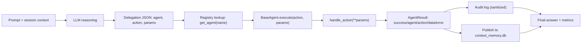
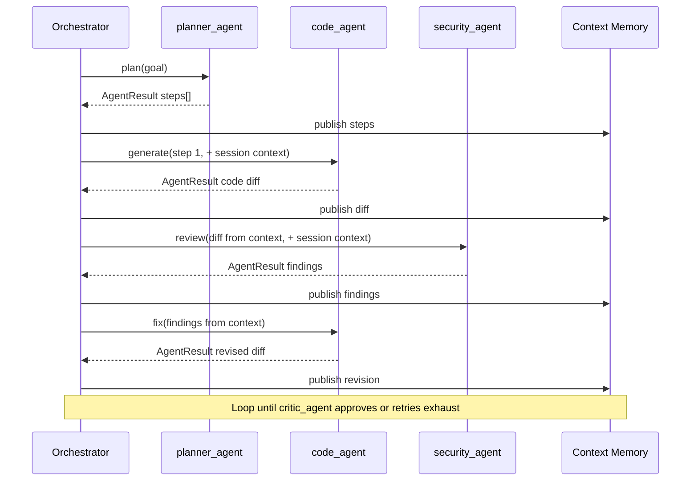

# Limbi — Agent Specification & Protocol Reference

**Version:** 2.1.16
**Scope:** Authoring, registering, routing, steering, and distributing agents and skills

---

## 1. Base Agent Contract

Every agent is a Python class inheriting from `BaseAgent` in `agents/__init__.py` (or `agents/base.py` where extracted). The contract is deliberately small so 90 agents stay uniform.

### 1.1 Interface

```python
from agents import BaseAgent, AgentResult

class SecurityAgent(BaseAgent):
    name = "security_agent"
    description = "Security reviews, dependency scans, secrets checks, risk summaries."
    # action_name -> {description, params schema, examples}
    actions = {
        "review": {"description": "Review a diff or file for risks.", "params": {"target": "str: path or diff text"}},
        "scan_deps": {"description": "Summarize dependency risk.", "params": {"manifest": "str: requirements path"}},
    }

    def handle_review(self, target: str) -> AgentResult:
        # ... domain work, no LLM calls needed for deterministic parts ...
        return AgentResult(success=True, agent=self.name, action="review", data={"findings": [...]})

    def handle_scan_deps(self, manifest: str = "requirements.txt") -> AgentResult:
        return AgentResult(success=True, agent=self.name, action="scan_deps", data={...})
```

Rules:

- `name`: lowercase snake_case, ends with `_agent`, exactly matches the registry key and the LLM-facing name.
- Actions are exposed **only** via methods named `handle_<action>`; the `<action>` suffix becomes the routable action name. No decorator needed.
- `execute(action, params)` (provided by `BaseAgent`) resolves `handle_<action>`, validates required params, catches exceptions into `AgentResult(success=False, ..., error="...")`, and records timing.
- Registration: import the module once (see `main.py` / `agents/__init__.py` imports) or call `register_agent(instance)`; verify with `python -m limbi --list-agents`.

### 1.2 `AgentResult` Schema

```python
AgentResult(
    success: bool,   # True if the action completed as specified
    agent: str,       # e.g. "security_agent"
    action: str,      # e.g. "review"
    data: dict,       # JSON-serializable payload; shape is action-specific
    error: str | None # machine-readable class + one-line message when success is False
)
```

Serialized form (audit DB, API, MCP):

```json
{"success": true, "agent": "security_agent", "action": "review",
 "data": {"findings": [{"severity": "high", "item": "hardcoded secret"}]}, "error": null}
```

Conventions: `data` MUST be JSON-serializable (no tracebacks, no binary); `error` MUST be one line (`ClassName: message`); secrets MUST never appear in either field — the audit sanitizer enforces this but agents should avoid emitting them in the first place.

### 1.3 Authoring Checklist

1. Subclass `BaseAgent`, set `name`, `description`, `actions`.
2. Implement one `handle_<action>` per advertised action; keep deterministic work (file I/O, parsing, scoring) inside the handler, use the orchestrator-provided LLM only via returned prompts when reasoning is needed.
3. Return `AgentResult` on all paths; never raise to the orchestrator.
4. Add tests under `tests/` invoking `execute()` directly (no LLM required).
5. Document the action in the registry description so the router can match it.

---

## 2. Shared Context Protocol

Agents are **decoupled**: they never import or call each other. All cross-agent communication flows through `agents/context_memory_agent.py` backed by `context_memory.db`.

**Consume** (at the start of a handler or via orchestrator-injected preamble):

```python
from agents.context_memory_agent import get_session_context, get_shared_state_value

ctx = get_session_context(session_id)   # {goal, focus, summary, recent_results[]}
goal = get_shared_state_value(session_id, "goal")
```

The orchestrator injects a compact `Session Context` block (goal, focus, summary, last N result digests + graph neighbors) into the system prompt, so LLM-routed agents see it automatically. Direct-call agents (`POST /api/agents/{a}/{x}`) can read it explicitly.

**Publish** (orchestrator does this automatically after every `execute`):

```python
publish_agent_result(session_id, result)  # creates result node + edges
record_session_turn(session_id, role, text)
```

Handler authors MUST NOT write to `context_memory.db` directly except through these helpers. Payloads should be digests (findings, decisions, file paths, key numbers), not full transcripts — the graph links back to the full turn if detail is needed.

**Isolation guarantees:** keys are namespaced by `session_id`; one session cannot read another's KV. `set_shared_state_value` overwrites only the caller's session. There is no global mutable blackboard.

---

## 3. Agent Taxonomy & Domain Catalog

90 agents / 469 actions across 6 categories. Routing criteria below are what `router_agent` and the system prompt use.

### 3.1 Cognitive / Reasoning (14)

`planner_agent`, `critic_agent`, `router_agent`, `react_agent`, `reflex_agent`, `model_reflex_agent`, `taskloop_agent`, `memory_agent`, `context_memory_agent`, `swarm_agent`, `evaluation_agent`, `learning_agent`, `knowledge_agent`, `research_agent`.
**Route here when:** the task is to decompose, critique, classify, iterate, remember, coordinate, evaluate, or gather information — before any domain work starts. Default first hop for vague or multi-step prompts is `planner_agent` (or `router_agent` for classification).

### 3.2 Engineering (14)

`code_agent`, `file_agent`, `git_agent`, `database_agent`, `testing_agent`, `qa_agent`, `migration_agent`, `docs_agent`, `documentation_agent`, `data_agent`, `nlp_agent`, `analytics_agent`, `reporting_agent`, `performance_agent`.
**Route here when:** the task touches source, files, schemas, tests, quality, or prose artefacts. `code_agent` generates/explains/debugs; `file_agent` performs I/O; `testing_agent`/`qa_agent` validate; `docs_agent`/`documentation_agent` write user-facing docs.

### 3.3 Platform / DevOps (21)

`devops_agent`, `cicd_agent`, `sre_agent`, `incident_agent`, `observability_agent`, `aws_agent`, `gcp_agent`, `azure_agent`, `kubernetes_agent`, `api_gateway_agent`, `workflow_agent`, `integration_agent`, `auth_agent`, `feature_flag_agent`, `notification_agent`, `scheduler_agent`, `execution_backend_agent`, `os_agent`, `browser_agent`, `web_scraping_agent`, `tool_builder_agent`.
**Route here when:** the task concerns build, deploy, run, observe, or integrate. Cloud-vendor agents (`aws/gcp/azure`) for provider-specific plans; `kubernetes_agent` for manifests/scaling; `incident_agent`/`sre_agent` for triage/reliability; `browser_agent`/`web_scraping_agent` for fetch/extract/interact.

### 3.4 Security / Compliance (6)

`security_agent`, `compliance_agent`, `policy_agent`, `approval_agent`, `legal_agent`, `government_agent`.
**Route here when:** the task involves risk, secrets, dependencies, audits, policy, contracts, or human approval gates. Security review SHOULD run after code changes and before deployment plans are finalized.

### 3.5 Business / Ops (16)

`finance_agent`, `sales_agent`, `payments_agent`, `cost_agent`, `procurement_agent`, `customer_support_agent`, `customer_success_agent`, `marketing_agent`, `social_media_agent`, `hr_agent`, `recruiting_agent`, `onboarding_agent`, `project_management_agent`, `jira_agent`, `comms_agent`, `feedback_agent`.
**Route here when:** the task is a business artefact (forecast, proposal, campaign, ticket response, sprint plan). `project_management_agent`/`jira_agent` bridge engineering plans into delivery tracking.

### 3.6 Industry / Domain (19)

`healthcare_agent`, `education_agent`, `real_estate_agent`, `ecommerce_agent`, `insurance_agent`, `logistics_agent`, `hospitality_agent`, `travel_agent`, `manufacturing_agent`, `agriculture_agent`, `energy_agent`, `sustainability_agent`, `blockchain_agent`, `iot_agent`, `media_agent`, `design_agent`, `multimodal_agent`, `simulation_agent` (+ registry extensions toward 90).
**Route here when:** the prompt names a vertical or needs domain-shaped output (lesson plan, listing, claim checklist, route plan). These agents shape generic capabilities into industry-expected formats; they delegate back to engineering/platform agents for implementation details.

**Routing precedence:** explicit user request (`/agents` choice or `use X agent` in prompt) > `router_agent` classification > orchestrator heuristic (keyword + registry match) > `planner_agent` fallback decomposition.

---

## 4. Shared Steering Protocol (`agent.md`)

A provider-neutral Markdown file that steers every agent and every provider from one place.

**Resolution:** `./agent.md` (repo root, checked in) is the default; `.limbi/agent.md` (workspace-local) overrides it when present. `resolve_agent_guide_path()` implements this order; `load_agent_guide_text()` returns the winning file's text (empty string if neither exists).

**Syntax:** plain Markdown — headings, bullets, code fences, no vendor tags. Example:

```markdown
# Project Steering
- Stack: Python 3.11+, FastAPI, Ruff.
- Always run security_agent.review after code changes.
- Docs live in docs/; update them with every feature.
- Never commit secrets; use env vars.
```

**Injection rules:**

1. Full text is appended as a fenced `## Shared Project Guidance (agent.md)` section of the system prompt.
2. A one-line pointer (`Steering: <path> (<n> chars)`) is stored in shared session state so agents can cite it.
3. Budget-capped: if the guide exceeds the steering allowance, it is truncated with a `[truncated]` marker and the full path is noted so the model can request it via `file_agent`.

**Overriding:** workspace `.limbi/agent.md` fully replaces root `agent.md` (no merging) — intentional, so local experiments never leak into the committed guide. Delete the override to revert. Skills may ship suggested `agent.md` snippets but MUST NOT auto-install them; installation requires explicit user approval.

---

## 5. Custom Skill Manifest Spec

Skills are reusable, provider-aware task packs stored in `.limbi/config.json` and distributable via `.limbi/skill_hub/`. Schema is compatible with `agentskills.io` front-matter plus Limbi runtime fields.

```yaml
# skill.yaml (or SKILL.md front-matter)
name: deploy-review            # unique, kebab-case
version: 1.2.0
description: Release readiness review pipeline
provider: inherit             # 'inherit' = use current shell provider, or pin e.g. 'openai'
model: inherit                # model id or 'inherit'
tags: [devops, security, release]
examples:
  - "review the release candidate for safety"
instructions: |               # steering text injected like a scoped agent.md
  1. Collect diff via git_agent.
  2. Run security_agent.review and testing_agent.plan.
  3. Summarize go/no-go with rollback steps.
agents: [git_agent, security_agent, testing_agent, reporting_agent]
env: {}                       # optional shared env for the skill run
```

**Lifecycle:**

| Operation | Command | Effect |
|-----------|---------|--------|
| Create | `/skills` → create | Validates manifest, saves to `config.json`, optional approval-gated self-learning draft |
| Update / refine | `/skills` → update | Version bump, changelog note |
| Delete | `/skills` → delete | Removes from `config.json` (published hub copies persist) |
| Run | `/skill <name> <task>` | Borrows pinned provider/model (or inherits), executes instructions through the orchestrator, restores original shell selection |
| Export / import | `/skills` → export/import | Single skill or pack (`.zip`/dir) |
| Publish | `/skills` → publish | Copies pack into `.limbi/skill_hub/` for local sharing |

Runtime borrowing: the skill runner snapshots the current provider/model, switches to the skill's pin for the run, then restores — so one skill never permanently changes the user's shell.

---

## 6. Mermaid Flows

### 6.1 Generic Agent Execution Lifecycle



### 6.2 Multi-Agent Delegation & Context Memory Feedback Loop


