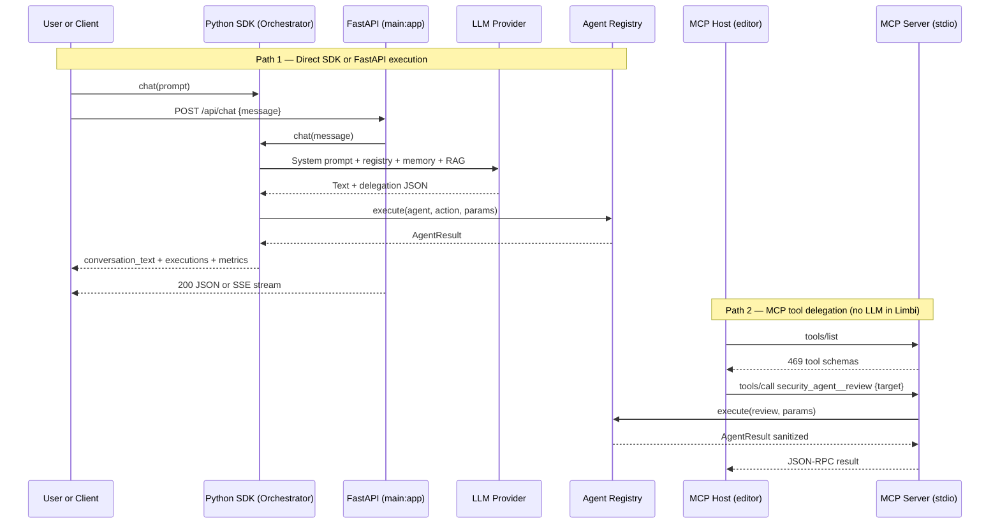

# Limbi — API Reference & Developer Protocol Contract

**Version:** 2.1.16
**Audience:** Developers integrating Limbi via Python SDK, HTTP/REST, or MCP

---

## 1. Python SDK Reference

Install: `python -m pip install limbi` (add extras: `limbi[openai]`, `limbi[rag]`, `limbi[server]`).

### 1.1 `limbi.Orchestrator`

Central orchestration class. All entry points converge here.

```python
from limbi import Orchestrator

orch = Orchestrator(session_id="demo", trust_mode="prompt")
```

**Constructor parameters:**

| Parameter | Type | Default | Description |
|-----------|------|---------|-------------|
| `session_id` | `str` | auto UUID | Namespaces `context_memory.db` KV, episodic graph nodes/edges, session transcripts in `.limbi/sessions/`. Reuse an ID to resume a session. |
| `trust_mode` | `str` | `"prompt"` | `"prompt"` = interactive trust handshake on untrusted workspaces; `"require-trusted"` = raise on untrusted (CI/service use); `"bypass"` = testing only, never production. |
| `workspace_root` | `Path \| str` | `cwd` | Workspace whose `.limbi/` is loaded. No parent traversal. |
| `provider_config` | `ProviderConfig \| None` | env-derived | Overrides `LLM_*` env. See Section 2 of `configuration_and_providers.md`. |

**Methods:**

#### `async chat(prompt: str) -> dict`

One full orchestration turn: load config/registry/memory/RAG/agent.md → classify complexity → invoke LLM → parse delegations → execute agents with retries → log + publish → return final payload.

```python
result = await orch.chat("Plan a safe deployment with testing, security, and rollback tasks.")
print(result["conversation_text"])
```

Request: `prompt: str` (non-empty, max ~32k chars; URLs trigger grounded research path).
Response dict:

```json
{
  "conversation_text": "Final grounded answer...",
  "session_id": "demo",
  "executions": [
    {"success": true, "agent": "planner_agent", "action": "decompose",
     "data": {"steps": [...]}, "error": null, "latency_ms": 420}
  ],
  "metrics": {"latency_s": 8.4, "prompt_tokens": 2140, "completion_tokens": 612,
              "total_tokens": 2752, "hallucination_pct": 12,
              "complexity": "standard", "budget": 2048},
  "context_summary": "compressed rolling summary string"
}
```

Errors are returned as failed `executions` entries plus a user-facing `conversation_text`; `chat()` raises only on untrusted workspace (`trust_mode="require-trusted"`) or empty prompt.

#### `async chat_stream(prompt: str) -> AsyncIterator[dict]`

Same lifecycle as `chat()` but yields SSE-style events: `{"type":"stage","stage":"planning","elapsed_s":1.2}`, `{"type":"delegation","agent":"...","action":"..."}`, `{"type":"result","result":{...}}`, terminal `{"type":"final", ...same as chat()...}`. Used by FastAPI streaming and the CLI live indicator.

#### `ingest_codebase(path: str) -> dict`

```python
print(orch.ingest_codebase("."))
# {"indexed_files": 312, "chunks": 1840, "store": ".limbi/chroma_db", "skipped": [...]}
```

Requires `pip install "limbi[rag]"`. Chunks files (1–2 KB, overlap ~200 chars, respects `.gitignore`), embeds via configured embedding model, persists to `.limbi/chroma_db/`. Without ChromaDB returns `{"error": "chromadb not installed..."}` and chat continues without RAG.

#### `vector_store_stats() -> dict`

```python
print(orch.vector_store_stats())
# {"collections": 1, "documents": 1840, "dimension": 384, "persist_dir": ".limbi/chroma_db"}
```

### 1.2 Helper Functions

```python
from limbi import list_agents, get_llm_provider

agents: dict[str, list[str]] = list_agents()
# {"code_agent": ["generate","explain","review","debug"], ...}  # 90 keys, 469 total actions

provider = get_llm_provider()   # resolves ProviderConfig from env + .limbi/config.json
print(provider.info())          # {"provider": "ollama", "model": "llama3.2:3b", "local": true}
```

- `list_agents()` — pure, no I/O; reflects currently imported/registered agents.
- `get_llm_provider(config=None)` — factory returning a `BaseChatModel`-compatible provider across 19+ modes. Local endpoints skip key validation.

### 1.3 Data Contract: `AgentResult`

```python
from agents import AgentResult  # or limbi.agents.AgentResult
AgentResult(success=True, agent="security_agent", action="review",
            data={"findings": [...]}, error=None)
```

| Field | Type | Rules |
|-------|------|-------|
| `success` | `bool` | Required. `False` iff the action did not complete. |
| `agent` | `str` | Required. Exact registry name (`*_agent`). |
| `action` | `str` | Required. Suffix of the `handle_<action>` method. |
| `data` | `Any` (JSON-serializable dict preferred) | Payload on success; partial evidence on failure. Never secrets/tracebacks. |
| `error` | `Optional[str]` | `None` on success; `"ClassName: one-line message"` on failure. |

Serialization: `result.to_dict()` → plain dict for audit DB, REST, and MCP. Deserialization validates all five keys.

---

## 2. FastAPI HTTP/REST Backend Reference

Run: `python -m pip install "limbi[server]"` then `uvicorn main:app --reload` (repo root). Base URL default `http://127.0.0.1:8000`.

### 2.1 Authentication & CORS

- When `LIMBI_API_KEY` is set, **every** `/api/*` request MUST include `Authorization: Bearer <LIMBI_API_KEY>`, else `401`. When unset, local requests pass (single-user laptop default).
- `LIMBI_CORS_ORIGINS` (comma-separated, defaults to `http://127.0.0.1:8000,http://localhost:8000`) configures `CORSMiddleware`. Non-listed browser origins get no ACAO headers. VS Code extension mirrors the key via `limbi.apiKey`.
- Errors are sanitized: `{detail: "<safe message>", code: "<CLASS>"}` — never stack traces.

### 2.2 Endpoints

#### `POST /api/chat` — synchronous

```bash
curl -X POST http://127.0.0.1:8000/api/chat \
  -H "Content-Type: application/json" \
  -H "Authorization: Bearer $LIMBI_API_KEY" \
  -d '{"message":"prepare a deployment checklist","session_id":"rel-42","stream":false}'
```

Request schema: `{message: str (required), session_id?: str, stream?: false, provider?: str, model?: str}`.
Response `200`: same shape as `Orchestrator.chat()` (`conversation_text`, `executions`, `metrics`, `session_id`).

#### `POST /api/chat` — streaming (`stream: true`)

Returns `text/event-stream` (SSE). Events: `stage`, `delegation`, `result`, `final`, each a `data: {...}\n\n` frame. Client closes on `final`. Timeouts: heartbeat every 15 s; server-side turn cap 10 min (returns partial `final` with zombie-flagged tasks).

#### `POST /api/chat/clear`

Body: `{session_id: str}`. Clears in-memory history + session transcript. Long-term `memory.db` facts and audit rows persist. Response: `{"cleared": true, "session_id": "..."}`.

#### `GET /api/agents`

Response: `{"count": 90, "actions": 469, "agents": {"code_agent": ["generate", ...], ...}}`. No auth-exempt fields; safe to cache for 60 s.

#### `POST /api/agents/{agent_name}/{action}`

Direct invocation bypassing LLM routing — for pipelines and debugging.

```bash
curl -X POST http://127.0.0.1:8000/api/agents/security_agent/review \
  -H "Content-Type: application/json" -d '{"params": {"target": "diff.txt"}}'
```

Path params validated against registry (`404 unknown agent/action` with closest-match hint). Body: `{params: dict, session_id?: str}`. Response: single `AgentResult` dict + `latency_ms`. Also publishes to context memory and audit log.

#### `GET /api/audit/executions?session_id=&limit=50&offset=0`

Returns sanitized rows newest-first: `[{execution_id, session_id, agent, action, success, latency_ms, tokens_prompt, tokens_completion, hallucination_score, timestamp}]`. Full `data` truncated to 4 KB with `truncated: true` flag; detail via per-execution lookup in server logs only.

#### `GET /api/audit/stats?session_id=`

Response: `{"total": 128, "success_rate": 0.94, "by_agent": {...}, "by_action": {...}, "avg_latency_ms": 610, "total_tokens": 412000}`.

#### `POST /api/rag/ingest` & `GET /api/rag/stats` (+ `GET /api/rag/query?q=`)

- Ingest body: `{path: "."}` → same result as `ingest_codebase()`. Requires `limbi[rag]` or `501`.
- Stats: `{"collections":1,"documents":N,"dimension":D,"persist_dir":".limbi/chroma_db"}`.
- Query: `{q, top_k=5}` → `[{path, span, score, snippet}]` grounded citations for prompts.

Convenience routes (`POST /api/devops/deploy`, `/api/git/merge`, `/api/jira/create`, `/api/webhooks/agent-callback`, `GET /api/system/rate-limits`, `POST /api/debug/parse`) follow the same auth/sanitization envelope; see OpenAPI at `/docs` when running.

---

## 3. MCP Server Stdio Protocol

Limbi exposes every agent action as an MCP tool over **stdio JSON-RPC 2.0** — no ports, no auth headers; the host process boundary is the trust boundary.

**Setup:**

```bash
python -m limbi --generate-mcp-config   # writes .vscode/mcp.json
```

Generated entry:

```json
{"servers": {"limbi": {"command": "python", "args": ["-m", "limbi.mcp_server"], "env": {}}}}
```

Custom servers/plugins added via interactive `/mcp` are merged into the same file.

**Lifecycle:**

1. Host spawns `python -m limbi.mcp_server`; server reads line-delimited JSON-RPC from stdin.
2. `initialize` → server replies with `protocolVersion`, `serverInfo: {name: "limbi", version: "2.1.16"}`, capabilities.
3. `tools/list` → server returns one tool per action: `{"name": "security_agent__review", "description": "...", "inputSchema": {"type":"object","properties":{"target":{"type":"string"}},"required":[...]}}}` (469 tools; hosts SHOULD paginate/filter).
4. `tools/call` request: `{"jsonrpc":"2.0","id":7,"method":"tools/call","params":{"name":"security_agent__review","arguments":{"target":"diff.txt"}}}` → server dispatches `get_agent("security_agent").execute("review", args)`, sanitizes, replies `{"jsonrpc":"2.0","id":7,"result":{"success":true,"agent":"...","action":"...","data":{...},"error":null}}`. Failures return `result` with `success:false` (not JSON-RPC `error`) unless the tool name itself is unknown.
5. `notifications/cancelled` aborts the running call (task marked interrupted); process exit ends the session.

**Interactive tool-call schema** (what LLM clients construct): tool name `"<agent>__<action>"`, arguments = handler params object. Unknown names yield a suggestion payload listing the 3 closest registered tools.

---

## 4. Mermaid Flow — SDK/FastAPI vs. MCP Delegation


