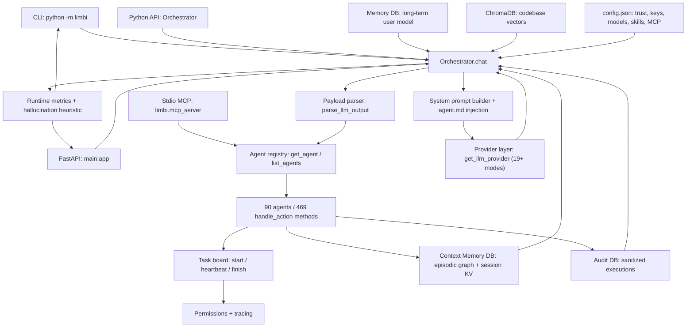
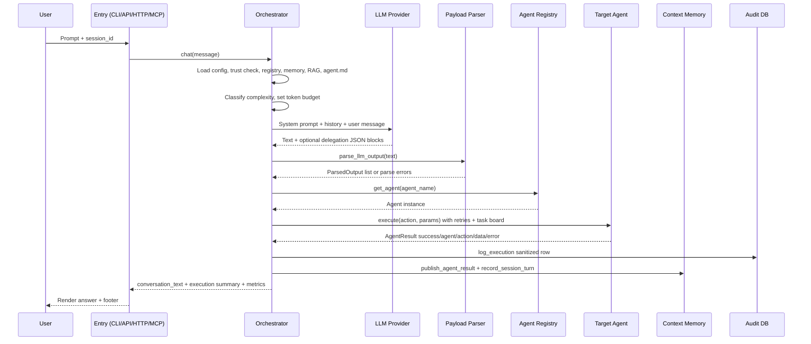
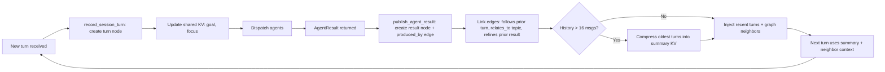

# Limbi — System Architecture Document

**Version:** 2.1.16
**Scope:** Interface Layer → Orchestration Engine → Provider & Memory Layer → Execution Runtime & Agents

---

## 1. High-Level System Topology

Limbi is a layered, workspace-scoped orchestration platform. All four entry points converge on a single `Orchestrator` core; all side effects converge on the `.limbi/` workspace.

| Layer | Components | Responsibility |
|-------|-----------|----------------|
| **Interface Layer** | CLI (`limbi.cli`, `python -m limbi`), Python API (`limbi.Orchestrator`, `list_agents`, `get_llm_provider`), FastAPI backend (`main:app`), Stdio MCP server (`limbi.mcp_server` / `limbi_mcp_server.py`), VS Code extension | Accept prompts, manage interactive state, transport JSON-RPC / HTTP / in-process calls |
| **Orchestration Engine** | `orchestrator.py` (`Orchestrator.chat`), `payload_parser.py`, `limbi/workspace.py`, `limbi/permissions.py`, `limbi/tracing.py`, `limbi/runtime_metrics.py`, `limbi/task_board.py` | Turn lifecycle, system-prompt construction, delegation parsing, task tracking, metrics, permissions |
| **Provider & Memory Layer** | `llm_provider.py` (19+ modes), `vector_store.py` (ChromaDB), `audit_log.py` (`audit.db`), `agents/context_memory_agent.py` (`context_memory.db`), `memory.db` long-term store | Vendor-neutral LLM invocation, episodic/graph memory, vector retrieval, durable audit |
| **Execution Runtime & Agents** | `agents/` registry (`get_agent`, `list_agents`, `BaseAgent`), 90 agents / 469 `handle_<action>` methods, schedulers, execution-backend catalog, browser/research helpers, skill runner | Domain work: code, files, git, tests, cloud, K8s, security, business, industry verticals |

Key invariants:

- The orchestrator never calls an LLM vendor SDK directly from agent code; all LLM access goes through `llm_provider`.
- Agents never call each other directly; they communicate only via orchestrator dispatch and `context_memory.db` publication.
- No network listener opens unless the user runs FastAPI or an MCP TCP bridge; default MCP is stdio.

---

## 2. Core Subsystems In-Depth

### 2.1 Orchestrator Core

**Turn lifecycle** (`Orchestrator.chat`, async):

1. Resolve workspace root, load `.limbi/config.json`, verify trust flag.
2. Load provider config (`ProviderConfig` from env + workspace overrides), agent registry snapshot (names + action lists), recent executions (`get_recent_executions`), session context (`get_session_context`), optional RAG hits (`VectorStore.query`), and `agent.md` guide text.
3. Compute adaptive budget: classify complexity (keyword + length + URL/research signals), set `max_tokens` / temperature; record complexity label for the metrics footer.
4. Construct `SYSTEM_PROMPT`: role block, capability block (converse + delegate), `{agent_registry}` block, naming rules, clarification rules, delegation JSON schema with 1–2 compact examples, memory summary block, RAG block, `agent.md` block.
5. Invoke provider chat model (`BaseChatModel` via LangChain core). Start elapsed timer + thinking-stage emitter (planning → searching → calculating → generating → delegating).
6. Parse output with `parse_llm_output` → list of `ParsedOutput`. For each: `evaluate_permission`, `get_agent(name)`, `BaseAgent.execute(action, params)` with retry/backoff, `start_task`/`heartbeat_task`/`finish_task`.
7. On success: `log_execution` (sanitized) + `publish_agent_result` + `record_session_turn`. On terminal failure: research-answer repair pass (rewrites accidental registry dumps into topic answers) or structured error summary.
8. Build final response: `conversation_text`, execution list, `build_runtime_metrics` (latency, prompt/completion/total tokens, hallucination heuristic %, complexity, budget).

**System prompt construction:** registry is rendered as `agent_name: action1, action2, ...` lines, truncated by budget. Recent-executions and session-summary blocks are capped so the prompt stays within the rolling window (`MAX_HISTORY_MESSAGES=24`, summarize beyond `SUMMARIZE_THRESHOLD=16`).

**Dynamic `agent.md` injection:** `limbi/workspace.py::load_agent_guide_text` checks `./agent.md` then `.limbi/agent.md` (workspace override wins). The text is injected verbatim into a fenced `Shared Steering` section plus a one-line pointer in shared session state. It is provider-neutral Markdown — no vendor-specific syntax.

**Payload parser** (`payload_parser.py`, `handle_<action>` schema extraction): scans for fenced `json` blocks containing `{"agent": ..., "action": ..., "params": {...}}` (also accepts `agent_name`/`tool` aliases). Validates names against `list_agents()`; unknown names produce a typed parse error the orchestrator turns into a user-facing suggestion. Params pass through unmodified; each agent's `handle_<action>(**params)` performs its own validation.

### 2.2 Memory Subsystem

| Store | File | Contents | Access path |
|-------|------|----------|-------------|
| Episodic graph log | `context_memory.db` (`turns`, `nodes`, `edges`) | Each turn + each agent result as a node; edges link turn→result, result→follow-up, topic→topic | `record_session_turn`, `publish_agent_result`, `get_session_context` |
| Shared session state | `context_memory.db` (`kv`) | `goal`, `focus`, `summary`, `agent_guide_pointer` | `get_shared_state_value` / `set_shared_state_value` |
| Long-term memory | `memory.db` | User model, durable facts via `memory_agent` | `memory_agent` actions |
| Audit trail | `audit.db` | Sanitized execution rows | `audit_log.log_execution`, `get_recent_executions` |
| Vector index | `chroma_db/` | Codebase/file embeddings | `VectorStore.ingest`, `VectorStore.query`, `vector_store_stats` |

**Graph-linked episodic logs:** nodes carry `{id, session_id, kind, agent, action, summary, ts}`; edges carry `{from, to, relation}` where relation ∈ `produced_by`, `follows`, `relates_to`, `refines`. Recall queries neighbors of the current goal/focus instead of replaying the full transcript.

**Rolling-context compression:** the orchestrator keeps at most 24 messages; beyond 16 it summarizes oldest turns into the `summary` KV slot and drops raw messages. Summaries are re-injected each turn, so long sessions stay bounded.

**ChromaDB embeddings:** opt-in (`pip install "limbi[rag]"`). `ingest_codebase(".")` chunks files, embeds, persists under `chroma_db/`. Query results enter the prompt as a `Retrieved Code Context` block with file paths and line spans. ChromaDB absence disables only RAG.

**Hallucination heuristic:** `runtime_metrics.build_runtime_metrics` scores vagueness markers (hedges, missing citations on research tasks, registry-dump shape) into a 0–100 % estimate shown in the footer. It is a triage signal, not a scientific measure.

### 2.3 Workspace Model

**Security perimeter:** the workspace root is the trust boundary. First launch prints a plain-text trust prompt (`Do you trust this workspace? [yes/no]`); `no` exits with code 0 and zero writes. Trust decision persists in `config.json` (`trusted: true`).

**`.limbi/` state isolation:**

```text
.limbi/
├── config.json          # provider, model, keys, trust, scheduler, backends, skills
├── audit.db             # sanitized execution log
├── memory.db            # long-term user/fact memory
├── context_memory.db    # episodic graph + shared session KV
├── chroma_db/           # optional vector index
├── sessions/            # per-session transcripts
├── logs/                # runtime logs
├── agent.md             # optional workspace steering override
└── skill_hub/           # published skill packs
```

Only the current working directory's `.limbi/` is used; parent traversal is not performed, preventing cross-project leakage.

**Trust verification handshake:** CLI → `workspace.resolve` → if no `config.json`, create skeleton → if `trusted` unset, prompt (explicit yes/no; bare Enter is not consent) → on yes, write `trusted:true` → proceed. FastAPI/MCP reuse the stored flag without re-prompting.

**Sanitization of audit traces:** `audit_log` strips API keys, tokens, authorization headers, and file contents beyond configured limits; exceptions are reduced to `{class, message}` with no traceback. API responses go through the same sanitizer plus `middleware.py` error mapping.

### 2.4 Integration Subsystem

**FastAPI HTTP/WebSocket routes** (`main.py`):

| Method & path | Purpose |
|---------------|---------|
| `GET /health` | Liveness |
| `POST /api/chat` | Chat turn (`{message, session_id?, stream?}`); streams SSE/chunks when `stream:true` |
| `POST /api/chat/clear` | Clear session history |
| `GET /api/agents` | List registry |
| `POST /api/agents/{agent}/{action}` | Direct agent invocation (bypasses LLM routing) |
| `GET /api/audit/executions`, `GET /api/audit/stats` | Sanitized audit views |
| `POST /api/rag/ingest`, `GET /api/rag/stats` | Codebase indexing + stats |
| Static `/` | Bundled web UI (`static/`) |

Auth via `Authorization: Bearer $LIMBI_API_KEY` when `LIMBI_API_KEY` is set; CORS restricted by `LIMBI_CORS_ORIGINS` (localhost defaults).

**Stdio MCP JSON-RPC protocol** (`limbi/mcp_server.py`): line-delimited JSON-RPC 2.0 over stdin/stdout. Methods: `initialize`, `tools/list` (derived from registry: `agent__action` tools with JSON schemas), `tools/call` (dispatches through the same `get_agent` → `execute` → `AgentResult` path, then sanitizes). No sockets; the client (VS Code, MCP host) spawns `python -m limbi.mcp_server`. `.vscode/mcp.json` generation merges built-in stdio entry with workspace custom servers/plugins from `/mcp`.

---

## 3. Mermaid Flows

### 3.1 Detailed System Component Topology



### 3.2 Request Lifecycle & Payload Parser Delegation Execution



### 3.3 Memory State Transitions & Graph Linking Flow


