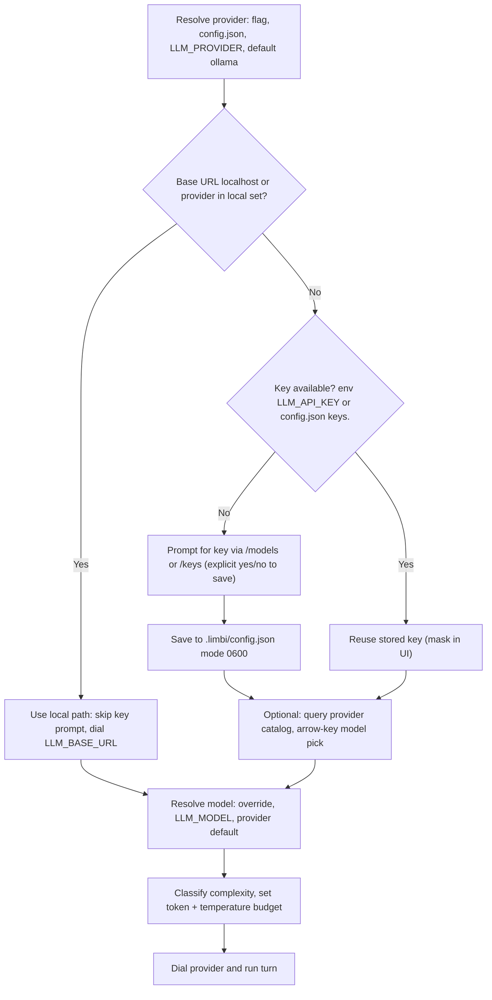

# Limbi — Configuration & Providers

**Version:** 2.1.16
**Scope:** Environment, 19+ provider matrix, workspace schema, adaptive budgeting

---

## 1. Global Environment Variables

| Variable | Default | Purpose | Example |
|----------|---------|---------|---------|
| `LLM_PROVIDER` | `ollama` | Provider key (see matrix). Case-insensitive. | `ollama`, `openai`, `openrouter` |
| `LLM_MODEL` | `llama3.2:3b` | Model ID passed to the provider. | `gpt-4o`, `claude-sonnet-4-20250514`, `meta-llama/Llama-3.1-8B-Instruct` |
| `LLM_API_KEY` | empty | API key for hosted/router providers. Ignored for local endpoints. `/keys` persists per-workspace copy. | `sk-...` |
| `LLM_BASE_URL` | provider default (`http://localhost:11434` for Ollama) | Override endpoint for local servers, gateways, proxies. `localhost`/`127.0.0.1` ⇒ treated as local, no key prompt. | `http://localhost:1234/v1` |
| `LLM_TEMPERATURE` | `0.2` | Base sampling temperature; adaptive budget may lower/raise within guardrails unless pinned. | `0.0`–`1.0` |
| `LLM_MAX_TOKENS` | `2048` | Ceiling for completion tokens; adaptive budget selects a value ≤ ceiling per complexity. | `1024`, `4096`, `8192` |
| `AZURE_DEPLOYMENT` | empty | Azure OpenAI deployment name (required for `azure`). | `my-gpt4o-deploy` |
| `AZURE_API_VERSION` | `2024-06-01` | Azure OpenAI API version. | `2024-06-01` |
| `LIMBI_API_KEY` | empty | Bearer token gating all `/api/*` routes. Empty = single-user local default. Mirror in VS Code `limbi.apiKey`. | long random secret |
| `LIMBI_CORS_ORIGINS` | `http://127.0.0.1:8000,http://localhost:8000` | Comma-separated allowed browser origins. | `https://app.example.com` |
| `HF_TOKEN_PATH` | `~/.cache/huggingface/token` | Compat token path for Hugging Face hub. | custom path in CI |

Precedence (highest first): explicit `ProviderConfig` argument → `.limbi/config.json` workspace values → shell env → built-in defaults. `/models` and `/keys` write to the workspace layer so shells stay clean.

---

## 2. 19+ Provider Configuration Matrix

Legend: **Local** = works offline, no key prompt; **Hosted** = key required; **Router** = key required, fans out to many models.

### 2.1 Local Providers

| Provider (`LLM_PROVIDER`) | Default endpoint | Key? | Extra install | Connection snippet |
|---------------------------|-----------------|------|---------------|--------------------|
| `ollama` | `http://localhost:11434` | No | — | `ollama serve && ollama pull llama3.2:3b` + `LLM_PROVIDER=ollama LLM_MODEL=llama3.2:3b` |
| `ollama_cloud` | `https://ollama.com/v1` | Yes (`OLLAMA_API_KEY` or `LLM_API_KEY`) | `limbi[openai]` | `LLM_PROVIDER=ollama_cloud LLM_BASE_URL=https://ollama.com/v1 LLM_MODEL=<cloud-model>` |
| `lmstudio` | `http://localhost:1234/v1` | No | `limbi[openai]` | `LLM_PROVIDER=lmstudio LLM_BASE_URL=http://localhost:1234/v1 LLM_MODEL=local-model-name` |
| `vllm` | `http://localhost:8000/v1` | No | `limbi[openai]` | `LLM_PROVIDER=vllm LLM_BASE_URL=http://localhost:8000/v1 LLM_MODEL=local-model-name` |
| `localai` | `http://localhost:8080/v1` | No | `limbi[openai]` | `LLM_PROVIDER=localai LLM_BASE_URL=http://localhost:8080/v1 LLM_MODEL=local-model-name` |
| `koboldcpp` | `http://localhost:5001/v1` | No | `limbi[openai]` | `LLM_PROVIDER=koboldcpp LLM_BASE_URL=http://localhost:5001/v1 LLM_MODEL=local-model-name` |
| `llamacpp` | `http://localhost:8081/v1` | No | `limbi[openai]` | `LLM_PROVIDER=llamacpp LLM_BASE_URL=http://localhost:8081/v1 LLM_MODEL=local-model-name` |
| `openai_compatible` | custom (must set `LLM_BASE_URL`) | No if localhost, else value in key field | `limbi[openai]` | `LLM_PROVIDER=openai_compatible LLM_BASE_URL=http://localhost:1234/v1 LLM_MODEL=x LLM_API_KEY=not-needed` |

All OpenAI-compatible local servers speak `/v1/chat/completions`; Limbi auto-detects `localhost`/`127.0.0.1`/`::1`/`*.local` as local and suppresses key prompts.

### 2.2 Hosted Model Providers

| Provider | Needs | Extra | Snippet |
|----------|-------|-------|---------|
| `openai` | `LLM_API_KEY=sk-...`, `LLM_MODEL=gpt-4o` | `limbi[openai]` | `LLM_PROVIDER=openai LLM_MODEL=gpt-4o` |
| `anthropic` | `LLM_API_KEY`, `LLM_MODEL=claude-sonnet-4-20250514` | `limbi[anthropic]` | `LLM_PROVIDER=anthropic ...` |
| `google` | `LLM_API_KEY` (AI Studio / Vertex via genai) | `limbi[google]` | `LLM_PROVIDER=google LLM_MODEL=gemini-2.0-flash` |
| `groq` | `LLM_API_KEY`, `LLM_MODEL=llama-3.1-70b-versatile` | `limbi[groq]` | `LLM_PROVIDER=groq ...` |
| `mistral` | `LLM_API_KEY` | `limbi[mistral]` | `LLM_PROVIDER=mistral LLM_MODEL=mistral-large-latest` |
| `cohere` | `LLM_API_KEY` | `limbi[cohere]` | `LLM_PROVIDER=cohere LLM_MODEL=command-r-plus` |
| `together` | `LLM_API_KEY` (Together AI) | `limbi[together]` | `LLM_PROVIDER=together LLM_MODEL=meta-llama/Llama-3.1-70B-Instruct-Turbo` |
| `azure` | `LLM_API_KEY` + `AZURE_DEPLOYMENT` + `AZURE_API_VERSION` + resource base URL | `limbi[azure]` | `LLM_PROVIDER=azure LLM_BASE_URL=https://<resource>.openai.azure.com AZURE_DEPLOYMENT=<dep>` |
| `ollama_cloud` | `OLLAMA_API_KEY`, cloud model ID | `limbi[openai]` | covered above; listed here as hosted variant |

### 2.3 Model Routers & Catalogs

| Provider | Endpoint | Needs | Notes |
|----------|----------|-------|-------|
| `openrouter` | `https://openrouter.ai/api/v1` | `LLM_API_KEY`, `LLM_MODEL=openai/gpt-4o` | `/models` lists catalog after key entry; supports per-request model routing. |
| `huggingface` | Inference Providers router | `LLM_API_KEY` (HF token), `LLM_MODEL=meta-llama/Llama-3.1-8B-Instruct` | Uses `huggingface-hub` compat shim; token path overridable via `HF_TOKEN_PATH`. |
| `chutes` | `https://llm.chutes.ai/v1` | `LLM_API_KEY`, model ID | OpenAI-compatible chat surface. |
| `bytez` | Bytez router | `LLM_API_KEY`, model ID | OpenAI-compatible chat surface. |

Router tip: set a generic `LLM_MODEL` once; switching routers is a one-variable change (`LLM_PROVIDER`) with no code edits.

---

## 3. Persistent Workspace Schema (`.limbi/config.json`)

Created on first trusted run. Human-readable JSON; keys managed via `/models` (provider/model pins) and `/keys` (create/replace/delete).

```json
{
  "version": 3,
  "trusted": true,
  "trusted_path": "/Users/ada/my-project",
  "path_hash": "sha256:9f2c…",
  "provider": "ollama",
  "model": "llama3.2:3b",
  "base_url": "http://localhost:11434",
  "temperature": 0.2,
  "max_tokens": 2048,
  "keys": {
    "openai": {"value": "sk-…(stored)", "updated_at": "2026-09-18T10:00:00Z"},
    "openrouter": {"value": "or-…", "updated_at": "2026-09-20T10:00:00Z"}
  },
  "model_overrides": {"skill:deploy-review": {"provider": "openai", "model": "gpt-4o"}},
  "skills": {"deploy-review": {"version": "1.2.0", "provider": "inherit"}},
  "mcp_servers": {"my-tools": {"command": "node", "args": ["server.js"]}},
  "scheduler": {"jobs": []},
  "execution_backend": {"default": "local"}
}
```

Semantics:

- `trusted` / `trusted_path` / `path_hash`: trust handshake record. If the directory moves or the hash mismatches, Limbi re-prompts.
- `provider/model/base_url/temperature/max_tokens`: workspace defaults shadowing env.
- `keys.*`: stored secrets. File mode `0600` on creation; values never printed (CLI masks to `…last4`) and never logged. `/keys` delete removes the entry immediately.
- `model_overrides` / `skills.*`: pinned provider/model per skill (`inherit` = use shell selection at run time).
- `mcp_servers`: custom MCP entries merged by `/mcp` into `.vscode/mcp.json`.
- `scheduler` / `execution_backend`: persisted cron-like jobs and default sandbox target (see `security_and_sandboxing.md`).

Do not hand-edit keys in place unless the CLI is closed; prefer `/keys` so masking, validation, and file locking apply.

---

## 4. Adaptive Runtime Token & Temperature Budgeting

Goal: small tasks stay cheap and deterministic; hard tasks get room to reason — without manual knob-twiddling.

**Complexity classifier** (runs before every LLM call): signals include prompt length, URL count, code-fence presence, words like `plan/deploy/migrate/research/compare`, delegation depth in history, and RAG-hit count. Output: one of `simple | standard | complex | research | build`.

| Complexity | Max tokens (≤ `LLM_MAX_TOKENS`) | Temperature | Behavior |
|------------|-------------------------------|-------------|----------|
| `simple` (greeting, lookup) | 512–1024 | 0.0–0.2 | Short, deterministic; registry block trimmed to top agents. |
| `standard` (explain, single-file edit) | 2048 | 0.2 | Default; full registry digest, recent turns verbatim. |
| `complex` (multi-file, multi-agent) | 4096 | 0.3–0.4 | Wider history, graph-neighbor context included. |
| `research` (URLs, web search) | 4096–6144 | 0.3 | Source-grounding blocks prioritized; registry trimmed to research + reporting agents. |
| `build` (scaffold, migrate, release plan) | 6144–8192 (capped by ceiling) | 0.4–0.5 for planning, 0.2 for code/security passes | Planner runs warmer, code/security handlers forced cooler via per-call override. |

Rules:

1. Env/workspace `LLM_MAX_TOKENS` / `LLM_TEMPERATURE` are ceilings/anchors — the adapter never exceeds the ceiling and never overrides an explicit per-call pin.
2. Code/security/compliance actions are clamped to ≤ 0.2 regardless of turn complexity (determinism over creativity).
3. Rolling compression (`SUMMARIZE_THRESHOLD=16`, cap 24 messages) keeps the prompt within budget; overflow sheds oldest verbatim turns first, never the steering (`agent.md`) or source-grounding blocks.
4. Current `complexity` + `budget` render in every CLI footer and every `/api/chat` metrics block for auditability.

---

## 5. Mermaid Flow — Provider Selection, Local Fallback & Key Resolution


