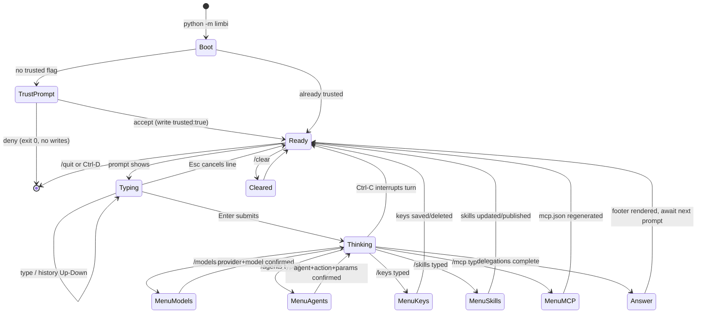

# Limbi — CLI, Terminal & UI Design System

**Version:** 2.1.16
**Scope:** Interactive terminal experience for `python -m limbi`

---

## 1. Design Philosophy

1. **Minimalist, zero-clutter.** The banner and `/help` show only the commands people use daily. Advanced commands (`/trace`, `/traces`, `/permissions`, `/eval`, `/benchmark`, `/list`, `/providers`, `/model`, `/key`) exist but stay hidden from the primary surface.
2. **Terminal-native.** Works in any ANSI terminal over SSH; no webview required. The FastAPI web UI mirrors the same information hierarchy but the CLI is canonical.
3. **Plain text first.** No decorative emoji spam. Status uses words and ASCII spinners, not icon walls. First-run and trust prompts are plain text.
4. **High scan-speed.** Answers render as tight Markdown (headings, tables, fenced code); execution evidence and metrics always sit in the same place — directly under the answer — so the eye never hunts.
5. **Keyboard-led control.** Single-line prompts for speed, explicit Esc-cancellation, arrow-key menus for selection screens. Destructive or persisting actions always require explicit `yes`/`no` (bare Enter is never consent).

---

## 2. Information Architecture

### 2.1 Primary Command Surface

Shown in the startup banner and `/help`:

| Command | Purpose | Notes |
|---------|---------|-------|
| `/models` | Choose provider + model for this session | Arrow-key list; queries live catalog after key entry; explicit save prompt |
| `/keys` | Manage saved provider API keys | Set / replace / delete in `.limbi/config.json` |
| `/skills` | Open custom skill manager | Create, update, delete, export/import, publish to `skill_hub/` |
| `/skill` | Run a saved custom skill with a task argument | ` /skill <name> <task>` |
| `/mcp` | Open MCP server + plugin manager | Add/update/delete custom servers; regenerate merged `.vscode/mcp.json` |
| `/agents` (`/agent` alias) | Manually pick one agent and run one action | Arrow-key agent list, then action list, then param prompts |
| `/trust` | Show workspace trust status | Read-only; trust is granted at first-run prompt |
| `/clear` | Clear conversation history | Clears in-memory history + session transcript; memory DB facts persist |
| `/help` | Show short help list | Primary commands only |
| `/quit` | Exit Limbi | Also `Ctrl-C` / `Ctrl-D` |

### 2.2 Secondary / Debug Commands

Available by typing but omitted from the banner: `/trace`, `/traces`, `/permissions`, `/eval`, `/benchmark`, `/list`, `/providers`, `/model`, `/key`. Rule: if a command is used less than ~5% of sessions or is diagnostic, it stays secondary.

### 2.3 Screen Zones

```text
+----------------------------------------------------------+
| Banner: product, version, agent/action counts, workspace |
+----------------------------------------------------------+
| Transcript: user prompts + assistant answers (scroll)    |
|   [thinking stage line, transient, overwritten]          |
+----------------------------------------------------------+
| Metrics footer (after each answer, single block)         |
+----------------------------------------------------------+
| Input: > <single-line prompt>                            |
+----------------------------------------------------------+
```

Transcript, footer, and input never overlap; the thinking line reuses one row until completion.

---

## 3. Terminal Display Standards

### 3.1 Status Indicators & Progress

While a turn runs, exactly one live status row is visible:

```text
⠋ planning… (3s)
⠋ searching web… (7s)
⠋ delegating to security_agent.review… (11s)
⠋ generating answer… (14s)
```

Stage vocabulary (fixed strings): `planning`, `searching`, `fetching`, `calculating`, `generating`, `delegating to <agent>.<action>`, `saving`, `compressing context`. Format: spinner + lowercase stage + ellipsis + `(<elapsed>s)` in gray. On completion the row is replaced by the answer; elapsed time moves into the metrics footer.

One-shot (non-interactive) mode prints the same stages to stderr so stdout stays pipe-clean.

### 3.2 Keybinding & Input Specs

| Key | Context | Behavior |
|-----|---------|----------|
| `Enter` | Input line | Submit prompt |
| `Esc` | Input line, non-empty | Cancel current typed line (clear buffer, stay in session) |
| `Up` / `Down` | Input line | Shell-style history navigation |
| `Up` / `Down` + `Enter` | `/models`, `/agents` menus | Move highlight, confirm selection |
| `Ctrl-C` | Anywhere | Cancel running turn (task marked interrupted); second press exits |
| `Ctrl-D` | Empty input | Exit |
| `y` / `n` | Save / trust / skill-approval prompts | Explicit consent; empty input re-prompts, never defaults to yes |

Multiline input: the prompt is single-line by default. Pasting multiline text is accepted and sent as one message; Esc before submit discards the whole buffer. No modal multiline editor — keeps behavior identical over SSH.

### 3.3 Metrics Footer Spec

Rendered after every assistant answer as one compact block:

```text
-- latency 8.4s | prompt 2,140 | completion 612 | total 2,752 | hallucination 12% | complexity standard | budget 2048 --
```

Layout rules:

- Order is fixed: `latency`, `prompt`, `completion`, `total`, `hallucination`, `complexity`, `budget`.
- Tokens are integers with thousands separators; latency shows one decimal + `s`.
- `hallucination` is labeled as heuristic in `/help` detail; values ≥ 40% render in alert red, 15–39% in status blue, < 15% in gray.
- `complexity` ∈ `simple | standard | complex | research | build`.
- The footer never wraps on ≥ 100-column terminals; on narrow terminals it wraps after `total`.

### 3.4 Empty, Error, and Edge States

- **Empty workspace first run:** plain-text trust question, then provider hint (`/models` to switch, `/keys` to save key). No ASCII art beyond the small startup banner.
- **Agent failure:** `action <agent>.<action> failed (<error class>): <one-line message> — retrying (1/3)` in alert red; final failure collapses to one line with a hint, full detail goes to `.limbi/logs/` and audit DB only.
- **Offline / no key:** `provider <name> needs an API key — run /keys to save one` (only for providers that truly need keys; local endpoints never show this).

---

## 4. Color Palette & Typography

ANSI-first; respects `NO_COLOR`. Suggested `rich` styles:

| Token | ANSI | Usage |
|-------|------|-------|
| Status blue | `36` (cyan) / `#61AFEF` | Thinking stages, in-progress delegation, links |
| Success green | `32` / `#98C379` | Completed answers, `trusted`, saved confirmations |
| Alert red | `31` / `#E06C75` | Failures, high hallucination (≥ 40%), destructive confirmations |
| Warning amber | `33` / `#E5C07B` | Retries, partial fetch, zombie tasks |
| Subtle gray metadata | `90` / `#7F848E` | Footer, elapsed timer, file paths, hints |
| Default text | terminal default | Body copy |

Typography rules:

- Body: terminal default font; Markdown headings rendered bold, no underline.
- Code: fenced blocks with language tag when known; inline code in reverse or dim.
- Spacing: one blank line before/after headings, tables, and code blocks; max one consecutive blank line; footer preceded by ` helps-- ` rule line.
- Width: soft-wrap at terminal width; tables reflow via `rich.table` with truncated cells + full content in logs.

---

## 5. Mermaid Flow — CLI Interactive State Machine & Screen Transitions


