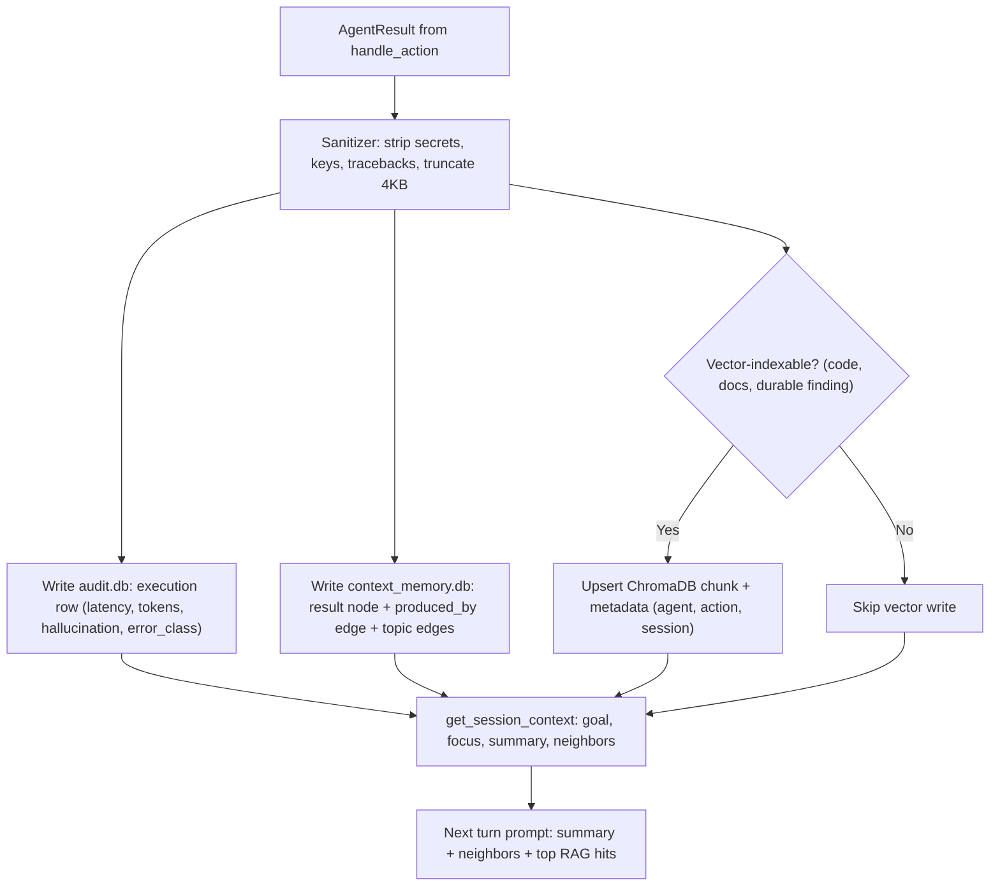

# Limbi — Memory & Storage

**Version:** 2.1.16
**Scope:** `.limbi/` layout, SQLite schemas, ChromaDB, context management, lifecycle

---

## 1. Workspace Layout Breakdown

Every project directory gets an isolated `.limbi/` state root on first trusted run. No parent traversal; no cross-project reads.

```text
.limbi/
├── config.json          # provider/model/keys/trust/skills/MCP/scheduler/backends (see configuration_and_providers.md)
├── agent.md             # optional workspace steering override (beats ./agent.md)
├── audit.db             # SQLite: sanitized execution log (Section 2.3)
├── memory.db            # SQLite: long-term episodic logs, user model, session metadata (Section 2.1)
├── context_memory.db    # SQLite: graph-linked shared session memory (Section 2.2)
├── chroma_db/           # ChromaDB persistent index: chunk embeddings for RAG (Section 3)
│   ├── chroma.sqlite3
│   └── <collection-dirs>/
├── sessions/            # per-session JSONL transcripts: <session_id>.jsonl
├── logs/                # runtime logs: orchestrator.log, provider.log, skills.log
└── skill_hub/           # published skill packs (skill.yaml + SKILL.md + assets)
```

Top-level `./agent.md` (repo-committed steering) is read-only input; `.limbi/` files are read-write runtime state and SHOULD be git-ignored except `agent.md` overrides teams explicitly share.

---

## 2. Relational & Graph Database Schemas (SQLite)

All three DBs are SQLite (WAL mode), zero external services. Open with `sqlite3 .limbi/<db>` for inspection.

### 2.1 `memory.db` — Long-Term & Episodic Store

Owned by `memory_agent` + orchestrator turn recorder.

| Table | Key columns | Purpose |
|-------|-------------|---------|
| `turns` | `id INTEGER PK`, `session_id TEXT`, `idx INTEGER`, `role TEXT (user\|assistant\|tool)`, `text TEXT`, `ts DATETIME` | Append-only conversation log; `idx` is per-session turn index. |
| `turn_index` | `session_id TEXT`, `keyword TEXT`, `turn_id INTEGER` (FTS5) | Full-text index for recall (`memory_agent.recall`). |
| `user_model` | `key TEXT PK`, `value TEXT`, `updated_at DATETIME` | Persistent user facts/preferences (`goal_style`, `stack`, `timezone`). Survives `/clear`. |
| `sessions` | `session_id TEXT PK`, `started_at`, `last_active`, `provider`, `model`, `summary TEXT` | Session metadata + rolling summary pointer. |

Retention: `turns` pruned per-session beyond 500 rows (oldest summarized into `sessions.summary` first). `user_model` never auto-pruned.

### 2.2 `context_memory.db` — Graph-Linked Shared Session Memory

The inter-agent blackboard. Namespaced by `session_id`; sessions cannot read each other.

| Table | Key columns | Purpose |
|-------|-------------|---------|
| `nodes` | `id TEXT PK`, `session_id TEXT`, `kind TEXT (turn\|result\|goal\|topic)`, `agent TEXT`, `action TEXT`, `summary TEXT`, `ref_turn INTEGER`, `ts DATETIME` | One row per turn and per `AgentResult`. |
| `edges` | `id INTEGER PK`, `session_id TEXT`, `from_id TEXT`, `to_id TEXT`, `relation TEXT (produced_by\|follows\|relates_to\|refines)`, `weight REAL` | Graph links enabling neighbor recall instead of full replay. |
| `agent_outputs` | `node_id TEXT PK`, `data_json TEXT (truncated 16KB)`, `truncated BOOL` | Digest of each result; full blobs stay in `sessions/*.jsonl`. |
| `kv` (`active_goal` lives here) | `session_id TEXT`, `key TEXT (goal\|focus\|summary\|agent_guide_pointer)`, `value TEXT`, `updated_at` | Mutable shared state: current goal, focus, compressed summary. |

Write path (orchestrator-owned): `record_session_turn()` → turn node + `follows` edge; `publish_agent_result()` → result node + `produced_by` edge + topic `relates_to`/`refines` edges via keyword overlap. Helpers: `get_session_context(session_id)` returns `{goal, focus, summary, recent_results[], neighbor_ids[]}`; `get/set_shared_state_value()` manage `kv`.

### 2.3 `audit.db` — Audit Logging Schema

Append-only via `audit_log.log_execution()`; sanitizer runs before insert AND before API serialization.

| Column | Type | Notes |
|--------|------|-------|
| `execution_id` | `TEXT PK` (UUID4) | Unique per agent invocation. |
| `session_id` | `TEXT` | Groups a turn's fan-out. Indexed. |
| `agent` | `TEXT` | Registry name. Indexed. |
| `action` | `TEXT` | Handler suffix. Indexed. |
| `success` | `INTEGER (0/1)` | Outcome. |
| `latency_ms` | `INTEGER` | Handler wall time (excludes LLM wait). |
| `tokens_prompt` / `tokens_completion` | `INTEGER` | Attributed slice of the turn's usage (heuristic split by delegation). |
| `hallucination_score` | `REAL (0–100)` | Heuristic at execution time (hedges, missing citations, dump-shape). |
| `sanitized_output` | `TEXT (≤4 KB, truncated flag)` | `data` digest with secrets/tracebacks stripped. |
| `error_class` | `TEXT NULL` | `ClassName` only, no message internals. |
| `timestamp` | `DATETIME` | UTC insertion time. Indexed. |

Query: `GET /api/audit/executions`, `GET /api/audit/stats`, or `sqlite3` directly. Purge: delete rows older than N days via `audit_log.prune(older_than_days=90)`; vacuum after.

---

## 3. ChromaDB Vector Store (`chroma_db/`)

Opt-in RAG index. Requires `pip install "limbi[rag]"`; absence disables only ingest/query.

- **Chunking:** code-aware splitter, ~1–2 KB chunks with ~200-char overlap; respects `.gitignore` + binary skip list; each chunk records `{path, start_line, end_line, lang}`.
- **Embeddings:** default sentence-transformer (384-d; model-recorded in collection metadata so dimension mismatches fail loudly on upgrade). Persisted under `chroma_db/` via `VectorStore.ingest`.
- **Retrieval:** cosine similarity, `top_k=5` default (tunable per query: `GET /api/rag/query?q=&top_k=`). Hits enter the prompt as a `Retrieved Code Context` block with path/span/score; scores below threshold are dropped with a `no relevant context` note rather than forced in.
- **Integration:** `orchestrate → VectorStore.query(prompt) → inject block → LLM reasons → delegations can cite chunk paths`. Stats: `orch.vector_store_stats()` / `GET /api/rag/stats`.
- **Maintenance:** re-ingest after large refactors (`ingest_codebase` is idempotent by file hash); delete `chroma_db/` to reset fully.

---

## 4. Context Window Management & Compaction

Problem: multi-turn + multi-agent sessions explode token usage. Limbi's answer is a bounded rolling window with summarization and dedup.

1. **Cap:** at most `MAX_HISTORY_MESSAGES=24` messages enter the prompt.
2. **Trigger:** beyond `SUMMARIZE_THRESHOLD=16` messages, oldest turns are summarized (extractive: keep decisions, file paths, numbers, errors; drop greetings/hedges) into `kv.summary`, then dropped verbatim.
3. **Dedup:** identical consecutive tool digests collapse to one + `×N` counter; repeated registry dumps are replaced by the research-repair path (rewritten as topic answer).
4. **Priority order when shedding:** verbatim old turns → old RAG hits → old result digests → (never shed) steering `agent.md`, current goal/focus, latest source-grounding block.
5. **Graph assist:** neighbor recall (`relates_to`/`refines` within 2 hops of current goal) is injected INSTEAD of full replay, so related work from 50 turns ago costs a few hundred tokens, not thousands.

Net effect: steady-state prompt size stays flat across long sessions; `/clear` resets the window but keeps `user_model` and audit history.

---

## 5. Lifecycle & Maintenance

| Task | Command / API | Effect |
|------|---------------|--------|
| Clear turn history | `/clear` (CLI) or `POST /api/chat/clear` | Drops in-memory history + session transcript window; graph nodes and audit rows persist; `user_model` untouched. |
| Session snapshot | Copy `.limbi/sessions/<id>.jsonl` + `sqlite3 context_memory.db .dump` | Portable replay/debug bundle. |
| Forget a user fact | `memory_agent.forget(key)` | Deletes one `user_model` row. |
| Prune audit | `audit_log.prune(older_than_days=90)` | Deletes old `audit.db` rows; run `VACUUM`. |
| Reset vectors | `rm -rf .limbi/chroma_db && ingest_codebase(".")` | Full RAG rebuild. |
| Zombie tasks | Automatic: `task_board` heartbeat watchdog flags tasks with no heartbeat > 5 min as `zombie`; scheduler retries or marks `dead` with reason. Inspect via session transcript + audit `error_class=ZombieTask`. | No manual DB edits needed. |
| Full workspace reset | `rm -rf .limbi` (then re-trust) | Nuclear option: all memory, audit, keys, skills, scheduler gone. Export skill packs first. |

Backup rule: `config.json` (minus `keys`), `*.db`, and `skill_hub/` are the restorable set; `chroma_db/` and `logs/` can be rebuilt.

---

## 6. Mermaid Flow — Concurrent Fan-Out to Audit, Graph & Vector Stores


