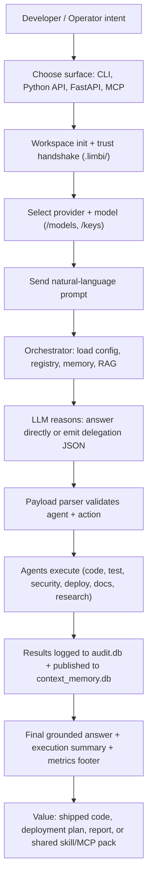

# Limbi — Product Requirements Document (PRD)

**Version:** 2.1.16
**Status:** Production / Open Source (Apache-2.0)
**Date:** 2026-10-02

---

## 1. Executive Summary

### 1.1 Mission

Limbi is an **omni-agent orchestration engine** that turns a single natural-language prompt into coordinated, auditable work executed by specialized agents. Instead of asking one general-purpose LLM to do everything, Limbi lets the LLM act as an orchestrator: it reasons, selects from **90 registered agents** exposing **469 actions**, dispatches structured delegation blocks, collects typed results, persists them to shared memory, and returns a grounded final answer.

### 1.2 Target Audience

| Audience | Primary need | Entry point |
|----------|--------------|-------------|
| **Application developers** | Generate, review, debug, test, and document code without switching tools | CLI (`python -m limbi`), MCP in VS Code / MCP clients |
| **Platform / DevOps engineers** | Plan deployments, CI/CD, Kubernetes, cloud, incidents, observability from one prompt | Python API (`Orchestrator`), FastAPI backend (`main:app`) |
| **AI researchers & builders** | Experiment with routing, memory, evaluation, multi-agent coordination, provider switching | Python API, agent SDK (`BaseAgent`), ChromaDB RAG |
| **Security / compliance reviewers** | Scan dependencies, review secrets, draft policy/compliance summaries with an audit trail | CLI + audit DB, `security_agent` / `compliance_agent` |
| **Business operators / founders** | Draft finance, sales, marketing, HR, support artefacts backed by research | CLI, FastAPI |

### 1.3 Value Proposition

1. **One prompt, many specialists.** Planning, code, testing, security, cloud, docs, and business logic run through one session.
2. **Provider freedom.** 19+ provider modes — local (Ollama, LM Studio, vLLM, LocalAI, KoboldCpp, llama.cpp, Ollama Cloud), hosted (OpenAI, Anthropic, Google, Groq, Mistral, Cohere, Together AI, Azure OpenAI), and routers/catalogs (OpenRouter, Hugging Face Inference Providers, Chutes, Bytez, OpenAI-compatible) — behind a single `get_llm_provider()` abstraction.
3. **Memory that survives turns.** Graph-linked episodic logs, rolling-context compression, shared session state (`context_memory.db`), long-term stores (`memory.db`), and optional ChromaDB vectors.
4. **Local-first trust.** Workspace sandbox (`.limbi/`), explicit trust handshake, sanitized audit traces, API-key gating, CORS allow-listing.
5. **Extensible without forks.** Custom skills (`/skills`, agentskills.io-compatible manifests), workspace MCP merging (`/mcp`), provider-neutral `agent.md` steering.

### 1.4 Success Metrics

- Single prompt completes a multi-step plan → delegate → verify → document loop without manual copy-paste.
- Provider switch (`/models`) requires zero application-code changes.
- Every delegated action produces an `AgentResult` row in `audit.db` and a context-memory publication.
- Offline local-provider chat works with no network beyond `localhost`.

---

## 2. Core User Personas & User Journeys

### Persona A — Ada, Application Developer (CLI / MCP)

**Goals:** Ship a feature: implement code, add tests, run a security pass, update docs.
**Journey:**

1. Opens project folder, runs `python -m limbi`. Accepts workspace trust prompt on first run.
2. Runs `/models` once to pin `ollama / llama3.2:3b` (local, no key) or sets a cloud key via `/keys`.
3. Types: `"Add retry logic to fetch_orders, add unit tests, and security-review the change."`
4. Watches live thinking stages (planning → generating → delegating), sees metrics footer (latency, tokens, hallucination %, complexity budget).
5. `planner_agent` breaks work down; `code_agent` + `file_agent` write code; `testing_agent` drafts tests; `security_agent` scans; `docs_agent` updates README. Results flow through shared context so the security review sees the actual diff.
6. Inspects durable task board for delegation status; re-runs failures; exits with `/quit`.

**Needs:** Minimal clutter, fast scan, Esc-to-cancel typing, arrow-key menus, plain-text output.

### Persona B — Dev, DevOps / Platform Engineer (Python API / FastAPI)

**Goals:** Automate release readiness: deployment plan, CI/CD check, incident triage, cost review — from pipelines or dashboards.
**Journey:**

1. `pip install "limbi[server,rag]"`, sets `LLM_PROVIDER`, `LLM_MODEL`, `LIMBI_API_KEY`, `LIMBI_CORS_ORIGINS`.
2. Uses Python API:

   ```python
   from limbi import Orchestrator
   orch = Orchestrator(session_id="release-42")
   result = await orch.chat("Prepare a safe deployment checklist with testing, security, and rollback tasks.")
   ```

   or FastAPI:

   ```bash
   uvicorn main:app --reload
   curl -X POST http://127.0.0.1:8000/api/chat -H "Content-Type: application/json" \
     -d '{"message":"prepare a deployment checklist","stream":false}'
   ```

3. Orchestrator fans out to `devops_agent`, `cicd_agent`, `sre_agent`, `security_agent`, `cost_agent`; publishes findings to shared context; logs each execution to `audit.db`.
4. Queries `GET /api/audit/executions` and `GET /api/audit/stats` for compliance evidence; optionally indexes repo via `POST /api/rag/ingest` for grounded answers.
5. Connects editors via stdio MCP (`python -m limbi.mcp_server`, `.vscode/mcp.json`) so agent tools appear natively in the IDE.

**Needs:** Auth, CORS control, sanitized errors, WebSocket/HTTP streaming, stable `AgentResult` schema, persistent scheduler + execution-backend catalog.

---

## 3. Functional Requirements

### FR-01 — Multi-Agent Orchestration

The system SHALL expose a central `Orchestrator` that accepts a natural-language prompt from any entry point (CLI, Python API, FastAPI, MCP), builds a system prompt containing the agent registry, invokes the configured LLM, and returns `conversation_text` plus an execution summary. It SHALL support sequential and fan-out delegation within one turn with `MAX_RETRIES=3` and exponential backoff.

### FR-02 — Delegation Parsing

The system SHALL parse structured JSON delegation blocks from LLM output via `payload_parser.parse_llm_output` into `ParsedOutput(agent, action, params)`. It SHALL reject unknown agent/action names with a plain-language fallback suggesting the closest registered agent, never inventing names. Malformed blocks SHALL be repaired once (research-answer repair path) or reported as failed delegations.

### FR-03 — Workspace Sandboxing

On first run in a directory the system SHALL create `.limbi/` (`config.json`, `audit.db`, `memory.db`, `context_memory.db`, `chroma_db/`, `sessions/`, `logs/`, `skill_hub/`). It SHALL prompt for explicit workspace trust; on denial it SHALL exit without side effects. All state writes SHALL stay inside the workspace root.

### FR-04 — Unified Provider Layer

The system SHALL abstract 19+ provider modes behind `get_llm_provider()` / `ProviderConfig`. Local endpoints (`localhost`, `127.0.0.1`) SHALL NOT trigger API-key prompts. `/models` SHALL query live catalogs after key entry; `/keys` SHALL persist keys to `.limbi/config.json`. Switching providers SHALL NOT require code changes.

### FR-05 — Memory Persistence

The system SHALL persist (a) episodic turn logs with graph node/edge links, (b) shared session state (goal, focus, summary) in `context_memory.db`, (c) long-term facts in `memory.db`, and (d) optional codebase embeddings in ChromaDB. Rolling-context compression SHALL trigger beyond `SUMMARIZE_THRESHOLD=16` messages, capped at `MAX_HISTORY_MESSAGES=24`. Memory SHALL survive provider/model switches.

### FR-06 — Web Grounding / Research

Prompts containing URLs SHALL trigger source-grounded fetch (title/headings/body extraction) and multi-URL comparison. Prompts requesting research without URLs SHALL trigger live search (Google path, DuckDuckGo path, auto fallback), top-page fetch, and summarization. JavaScript-blocked pages SHALL yield partial summaries or explicit fetch errors — never fabricated content.

### FR-07 — Custom Skill Lifecycle

The system SHALL support create / update / delete / list / run (`/skills`, `/skill`), import/export, and local publishing to `.limbi/skill_hub/` via an agentskills.io-compatible manifest (name, version, provider, model, tags, examples, instructions). Skill execution SHALL borrow the skill's pinned runtime then restore the original shell selection. Self-learning skill proposals SHALL require explicit user approval.

### FR-08 — Dynamic MCP Merging

The system SHALL generate `.vscode/mcp.json` from `python -m limbi --generate-mcp-config` using the stdio command `python -m limbi.mcp_server` (JSON-RPC over stdio). The interactive `/mcp` manager SHALL create/update/delete custom MCP servers and bundle plugins (multiple servers + shared env) and regenerate a merged config.

### FR-09 — Execution Task Board

Delegated workstreams SHALL create durable task records with heartbeats and zombie detection (`limbi.task_board`: `start_task`, `heartbeat_task`, `finish_task`). The board SHALL be inspectable for status, retries, and unattended/scheduler runs (natural-language cron-like jobs persisted across restarts).

### FR-10 — Runtime Auditing

Every agent execution SHALL append a sanitized record (timestamp, session, agent, action, params hash, success, latency, error class — no secrets, no raw tracebacks) to `audit.db` via `audit_log.log_execution`. `GET /api/audit/executions` and `GET /api/audit/stats` SHALL expose sanitized views. Internal exceptions SHALL NOT leak to clients.

---

## 4. Non-Functional Requirements

### NFR-01 — Latency Bounds

- Interactive first-token feedback (elapsed timer + thinking stage) SHALL appear within ~1s of prompt submit.
- One-shot local-model prompts (3B class) SHOULD complete common tasks in < 30s on a modern laptop; hosted models depend on provider RTT but MUST still stream progress.
- Metrics footer (latency, tokens, hallucination %) SHALL render on every completed turn.

### NFR-02 — Memory Footprint

- Base install (core deps only) SHALL stay lightweight; `rag`, `server`, and provider extras are opt-in.
- Local-first defaults (`ollama / llama3.2:3b`) MUST run on laptop-class hardware; adaptive token budgeting (small tasks = small budget) keeps context windows lean.
- ChromaDB ingestion is bounded and optional; absence of ChromaDB SHALL NOT break chat.

### NFR-03 — Offline / Local-First Capability

- Local providers SHALL work with no internet beyond localhost and no API key.
- Workspace state, memory, audit, skills, and scheduler SHALL function fully offline.
- Only cloud providers, live web research, and remote catalog listing require network.

### NFR-04 — Token-Budget Adaptability

The runtime SHALL classify task complexity (simple / standard / complex / research / build) and adjust `max_tokens` and temperature automatically (e.g., simple ≈ lower budget + lower temperature; multi-step builds/research ≈ higher budget). Current budget and complexity SHALL be visible in the CLI footer. Manual overrides via env (`LLM_MAX_TOKENS`, `LLM_TEMPERATURE`) SHALL take precedence.

### NFR-05 — Fault Isolation

- One failing agent action SHALL NOT abort sibling delegations; failures are captured as `AgentResult(success=False, error=...)` with retries.
- Provider errors, fetch blocks, and missing optional deps SHALL degrade gracefully with actionable messages.
- Zombie tasks (lost heartbeats) SHALL be flagged, not silently dropped.

### NFR-06 — Workspace Trust & Security Boundaries

- Untrusted workspaces SHALL NOT execute or persist state.
- `LIMBI_API_KEY` (Bearer) SHALL gate the HTTP backend; `LIMBI_CORS_ORIGINS` SHALL default to localhost only.
- Audit records and API error payloads SHALL be sanitized (no secrets, no stack traces).
- Saved provider keys live only in `.limbi/config.json` and are removable via `/keys`.
- MCP stdio transport SHALL NOT expose network listeners by default.

---

## 5. Mermaid Flow — End-to-End User Journey & Execution Value Stream


