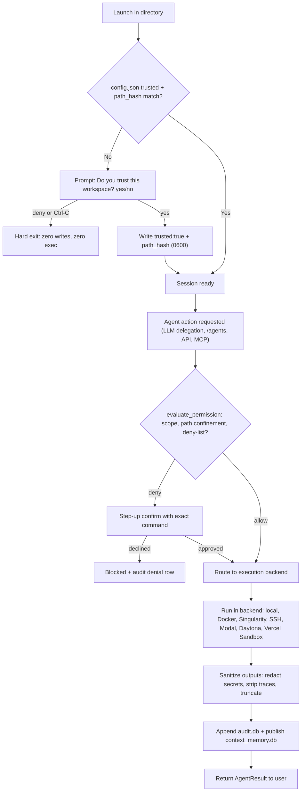

# Limbi — Security & Sandboxing

**Version:** 2.1.16
**Scope:** Trust boundary, execution isolation, credentials, network, research safety

---

## 1. Workspace Trust Boundary

The workspace directory is Limbi's primary security boundary. Nothing executes and nothing persists until trust is established.

**Initial launch challenge:** on first run in a directory with no (or mismatched) `.limbi/config.json` trust record, the CLI prints a plain-text prompt:

```text
You are about to let Limbi work in: /Users/ada/my-project
Limbi will create a local .limbi/ state folder here (config, memory, audit logs).
Do you trust this workspace? [yes/no]
```

Rules: bare Enter re-prompts (never consent); `yes` writes `{trusted: true, trusted_path, path_hash: sha256(canonical path)}` with file mode `0600`; `no` (or Ctrl-C) performs a **hard exit** (code 0, zero writes, zero network calls beyond what the provider check already avoided).

**Hash verification:** every subsequent launch recomputes the path hash. Mismatch (directory moved/copied, symlink swap, case-change on macOS) → re-challenge. `trust_mode="require-trusted"` (CI/services) raises instead of prompting; `"bypass"` exists for tests only.

**On denial:** no `.limbi/` creation, no key reads, no agent execution, no MCP config generation. The user must `cd` elsewhere or explicitly approve.

`/trust` at any time prints `{trusted, trusted_path, path_hash, match: true/false}` without mutating state.

---

## 2. Execution Backends & Sandboxing Modes

Generated code and shell-affecting actions run through a pluggable execution backend (default `local`, persisted in `config.json.execution_backend`, recommendable via `execution_backend_agent`).

| Backend | Isolation | Use when | Notes |
|---------|-----------|----------|-------|
| **Local subprocess** | None (user's UID, workspace cwd) | Everyday dev, tests, file edits | Safest default for trusted dirs; still permission-gated (Section 2.1). |
| **Docker containers** | Filesystem + net + PID namespaces, image-pinned | Untrusted codegen, dependency installs, repro scripts | Mounts workspace read-write at `/work` only; `--network none` unless the task needs fetch; non-root user; killed on timeout. |
| **Singularity / Apptainer** | User-namespace containers, HPC-friendly | Clusters without Docker daemon | SIF images, no daemon privilege; same mount/timeout policy as Docker. |
| **SSH remote targets** | Process boundary on another host | Fleet ops, GPU boxes, staging | Key-based auth only (no passwords); host key verified; commands allow-listed per target profile. |
| **Modal** | Ephemeral cloud sandbox | Bursty heavy jobs (large test matrices) | Token from env, never stored in `config.json`; results streamed back, sandbox destroyed. |
| **Daytona** | Managed dev-environment sandbox | Shareable repro environments | Same token hygiene as Modal; workspace sync is explicit, not automatic. |
| **Vercel Sandbox** | MicroVM per invocation | Short-lived web-adjacent runs | Tightest egress default-deny; fetch allow-list per task. |

Scheduler/unattended runs inherit the invoking session's backend; zombie-timeout kills apply to all backends (default 10 min per action, heartbeat every 30 s).

### 2.1 File Persistence Safety

`file_agent` and `code_agent` are permission-scoped, not free writers:

- Writes are confined to the workspace root (path traversal `..`, absolute paths outside root, and symlink escapes are rejected with `PermissionDenied`).
- Create/write/save tasks persist **only** through the agent-backed save workflow (code-agent produces content → file-agent writes), never by the LLM emitting a path claim in prose.
- Overwrite of existing files requires either (a) explicit user phrasing (`overwrite`, `replace`) or (b) interactive `yes` confirmation; otherwise a `.limbi-proposed` suffixed draft is written.
- Destructive patterns (`rm -rf`, `mkfs`, mass `chmod`, `.git/` rewrites, `~/.ssh` access) are deny-listed by `limbi/permissions.py::evaluate_permission` and require step-up confirmation describing the exact command.
- Every write records `{path, bytes, sha256_before, sha256_after}` in the audit row for rollback inspection.

---

## 3. Credential Hygiene & Secret Handling

**Key isolation:** provider keys live in exactly two places — shell env (ephemeral, preferred for CI) and `.limbi/config.json: keys.<provider>.value` (persisted via `/keys`, file mode `0600`, never world-readable). They are NEVER written to transcripts, `sessions/*.jsonl` plaintext beyond masking, logs, or skill packs. Skill export strips `env` secrets unless `--include-secrets` is passed with an explicit warning. Shell leakage guard: `/keys` shows only `…last4`; `provider.info()` reports `key_present: true/false`, never the value.

**Audit trace sanitization** (runs pre-insert AND pre-serialization):

1. Regex redaction: `sk-[A-Za-z0-9-_]{8,}`, `gh[pousr]_[A-Za-z0-9_]{8,}`, `xox[bpas]-…`, `AKIA[0-9A-Z]{16}`, `-----BEGIN (RSA )?PRIVATE KEY-----`, `password\s*[:=]\s*\S+`, `Bearer\s+\S+`, `api[_-]?key\s*[:=]\s*\S+` (case-insensitive) → `[REDACTED:<kind>]`.
2. Stack-trace stripping: `Traceback …` blocks and `File "...", line N` frames collapse to `error_class` only.
3. Size caps: `sanitized_output` ≤ 4 KB (truncated + `truncated:true`), file-content fields ≤ 64 KB with hash retained.
4. API/MCP responses pass through the same sanitizer plus `middleware.py` error mapping (`{detail, code}` envelope, HTTP-appropriate status, no internals).

Secret-scan CI (`scripts/` + `tests/test_audit_sanitizer.py`) asserts golden redaction cases on every PR.

---

## 4. Network Boundaries & API Security

- **FastAPI auth:** if `LIMBI_API_KEY` is set, all `/api/*` routes require `Authorization: Bearer <key>` (constant-time compare, `401` on miss, rate-limited to 30 failures/min/IP before 60 s cool-down). Unset = localhost single-user default; any non-loopback bind WITHOUT a key logs a loud warning and refuses to serve `/api/rag/ingest` and direct agent invocation.
- **CORS:** `LIMBI_CORS_ORIGINS` allow-list (default localhost only). No wildcard + credentials combination is permitted; unknown origins receive no ACAO headers. The bundled web UI is same-origin by default.
- **MCP stdio:** no sockets, no ports — the host process boundary IS the sandbox. A compromised tool call can only reach the agent registry, not arbitrary subprocesses, unless an execution backend explicitly grants it.
- **Egress posture:** local-provider chat is fully offline-capable. Only cloud providers, live research fetch, catalog listing, and remote backends (Modal/Daytona/SSH/Vercel) open egress, each with per-call timeouts.

---

## 5. Web Research & Scraping Safety

URL-bearing prompts take the grounded-research path under these constraints:

- **Fetch allow-listing:** `http(s)` only; blocks `file://`, `gopher://`, localhost/private-range targets (SSRF guard), and non-standard ports.
- **Timeouts/bounds:** 15 s connect+read cap, max 3 redirects (same-scheme downgrade refused), max 2 MB body (truncate + `truncated:true`), max 5 pages per research turn (top-ranked first).
- **Content extraction:** title/headings/main-text via readability-style parse; scripts/styles stripped before LLM exposure; raw HTML never enters the context window.
- **JS rendering isolation:** heavily dynamic pages fall back to `browser_agent` helpers (fetch, screenshot, click, type, form-fill) inside the selected execution backend (Docker/remote by default for untrusted domains) — never in the CLI process. Failed renders yield explicit partial-summary/fetch-error, never invented content.
- **Search grounding:** Google vs DuckDuckGo path auto-selected from prompt signals with `auto` fallback; result URLs re-fetched and summarized (no snippet-only answers for factual claims); multi-source comparison notes agreement/conflict explicitly.
- **Robots/hygiene:** honors `robots.txt` for bulk paths, sends Limbi user-agent, caches fetches per session to avoid re-hammering.

---

## 6. Mermaid Flow — Trust Handshake, Permission Verification & Execution Sandbox Pipeline


